# spring-cloud-kubernetes-samples


spring cloud kubernetes 微服务云原生示例。


本示例基于最新的spring boot、spring cloud、spring cloud kubernetes版本。基于spring cloud kubernetes的新特性([New Features For Spring Cloud Kubernetes In Spring Cloud 2021.0.0-M3](https://spring.io/blog/2021/10/26/new-features-for-spring-cloud-kubernetes-in-spring-cloud-2021-0-0-m3))，主要演示`Configuration Watcher`、`Config Server`、`Discovery Server`三大组件。


* Configuration Watcher

组件spring-cloud-kubernetes-configuration-watcher，当`ConfigMap`或`Secret`内容发生变化时，Configuration Watcher组件会观测到该事件，请求应用程序的`/refresh`端点，应用程序会自动`reload`，而通过`PropertySource`或`Environment`方式读取属性的值会自动刷新。**特别注意：使用@value注解方式的属性值不会自动刷新噢**

* Config Server

组件spring-cloud-kubernetes-configserver，该组件基于Spring Cloud Config Server，用于整合除configmap、secret以外的配置信息。

* Discovery Server

组件spring-cloud-kubernetes-discoveryserver，该组件以HTTP的方式对外提供kubernetes集群中可用的服务信息。结合`spring-cloud-starter-kubernetes-discoveryclient`使用可以在没有`~/.kube/config`文件的情况下访问kubernetes集群中的服务。


以上组件不需要进行二次开发，由spring cloud kubernetes提供，只需要部署到kubernetes集群中即可。在本示例中直接部署`manifests`目录下的文件即可。

其源码及官方文档：

https://github.com/spring-cloud/spring-cloud-kubernetes/tree/v2.1.3/spring-cloud-kubernetes-controllers

https://docs.spring.io/spring-cloud-kubernetes/docs/current/reference/html/#spring-cloud-kubernetes-configuration-watcher

https://docs.spring.io/spring-cloud-kubernetes/docs/current/reference/html/#spring-cloud-kubernetes-configserver

https://docs.spring.io/spring-cloud-kubernetes/docs/current/reference/html/#spring-cloud-kubernetes-discoveryserver

建议参考源码中的部署文件，spring cloud kubernetes文档中的部署文件有误，在实际使用过程中会因kubernetes权限的问题而导致服务间调用报错。


**以上三大组件不是spring cloud kubernetes微服务的必要组件，但正是有了这三大组件使得使用spring cloud kubernetes在本地开发及调用kubernetes集群中的服务有了便捷性。开发人员即使本地没有`~/.kube/config`文件，只有和kubernetes在同一个局域网内就可以正常开发及调用集群中的服务。**


## 一、环境配置

### 1、开发环境

- **JDK 1.8.0_201**
- **SpringBoot 2.7.3**

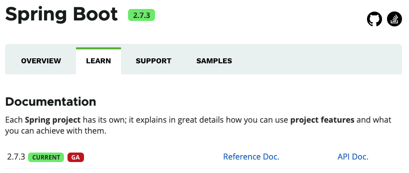

- **SpringCloud 2021.0.4**

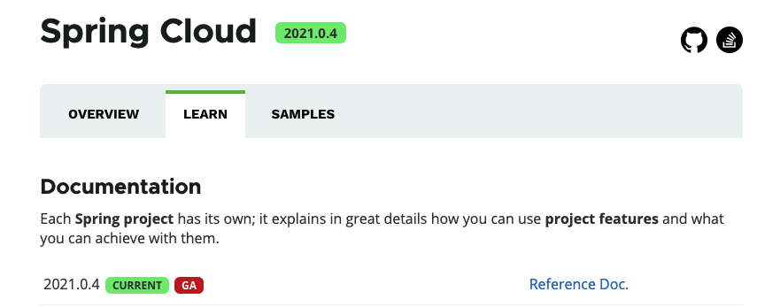

- **SpringCloudKubernetes：2.1.3**

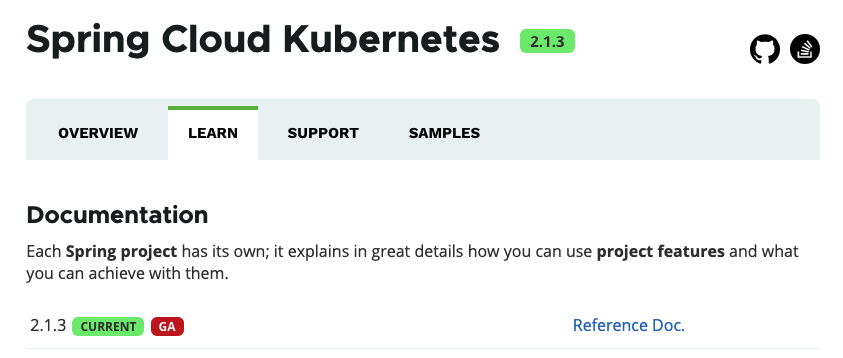

**注：spring boot、spring cloud、spring cloud kubernetes均使用目前最新的版本。**

### 2、kubernetes集群运行环境

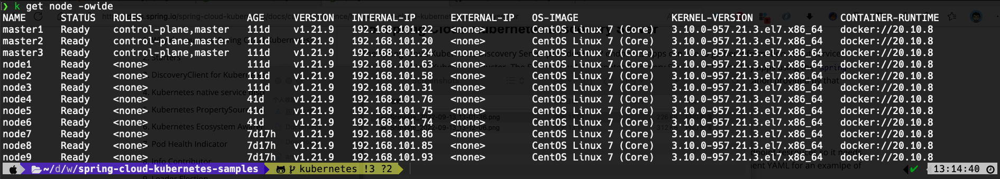

### 3、配置本地/etc/hosts文件

/etc/hosts

```
192.168.101.74 kubepi.cloudnative.io
192.168.101.74 configserver.cloudnative.io
192.168.101.74 discoveryserver.cloudnative.io
192.168.101.74 configsample.cloudnative.io
192.168.101.74 discoverysample.cloudnative.io
192.168.101.74 gateway.cloudnative.io
192.168.101.74 weiboservice.cloudnative.io
192.168.101.74 weatherservice.cloudnative.io
```

## 二、应用目录介绍

```
config-sample      # 演示configmap、secret读取及自动更新
discovery-sample   # spring cloud kubernetes服务发现及feign调用
gateway-sample     # spring cloud kubernetes整合gateway网关应用，聚合所有的服务
weather-service    # golang开发的天气预报服务
weibo-service      # python开发的微博头条服务
```

##  三、部署Configuration Watcher、Config Server、Discovery Server组件

### 1、应用manifests文件

```bash
k apply -f manifests
k get deploy
k get pod -owide
k get cm
k get svc
k get ingress
```

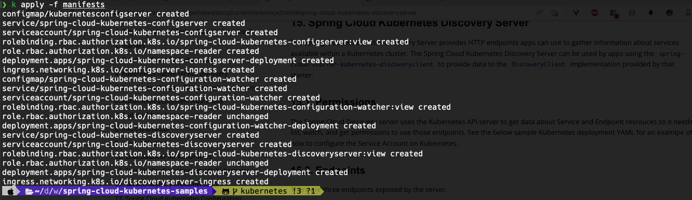

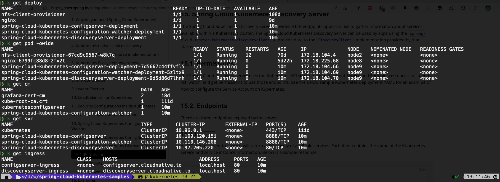

**注意：**

* 此处应使用源码中的部署文件，官方文档中的部署文件有问题。部署后服务间调用会报权限相关的错误。

https://github.com/spring-cloud/spring-cloud-kubernetes/tree/v2.1.3/spring-cloud-kubernetes-controllers

* 此处的ingress仅仅是便于在开发调试，实际生产环境中并不需要创建ingress。

### 2、访问Discovery Server

其接口API可参考 https://github.com/spring-cloud/spring-cloud-kubernetes/blob/v2.1.3/spring-cloud-kubernetes-controllers/spring-cloud-kubernetes-discoveryserver/src/main/java/org/springframewok/cloud/kubernetes/discoveryserver/DiscoveryServerController.java

* http://discoveryserver.cloudnative.io/apps

```bash
❯ http discoveryserver.cloudnative.io/apps
HTTP/1.1 200 OK
Connection: keep-alive
Content-Type: application/json
Date: Tue, 13 Sep 2022 05:25:16 GMT
Transfer-Encoding: chunked

[
    {
        "name": "spring-cloud-kubernetes-configserver",
        "serviceInstances": [
            {
                "cluster": null,
                "host": "172.18.104.66",
                "instanceId": "804d70c0-ac11-4b23-8229-74ce97bb7034",
                "metadata": {
                    "app": "spring-cloud-kubernetes-configserver",
                    "http": "8888",
                    "kubectl.kubernetes.io/last-applied-configuration": "{\"apiVersion\":\"v1\",\"kind\":\"Service\",\"metadata\":{\"annotations\":{},\"labels\":{\"app\":\"spring-cloud-kubernetes-configserver\"},\"name\":\"spring-cloud-kubernetes-configserver\",\"namespace\":\"default\"},\"spec\":{\"ports\":[{\"name\":\"http\",\"port\":8888,\"targetPort\":8888}],\"selector\":{\"app\":\"spring-cloud-kubernetes-configserver\"},\"type\":\"ClusterIP\"}}\n"
                },
                "namespace": "default",
                "port": 8888,
                "scheme": "http",
                "secure": false,
                "serviceId": "spring-cloud-kubernetes-configserver",
                "uri": "http://172.18.104.66:8888"
            }
        ]
    },
    {
        "name": "kubernetes",
        "serviceInstances": [
            {
                "cluster": null,
                "host": "192.168.101.20",
                "instanceId": "",
                "metadata": {
                    "component": "apiserver",
                    "https": "6443",
                    "provider": "kubernetes"
                },
                "namespace": "default",
                "port": 6443,
                "scheme": "http",
                "secure": false,
                "serviceId": "kubernetes",
                "uri": "http://192.168.101.20:6443"
            },
            {
                "cluster": null,
                "host": "192.168.101.22",
                "instanceId": "",
                "metadata": {
                    "component": "apiserver",
                    "https": "6443",
                    "provider": "kubernetes"
                },
                "namespace": "default",
                "port": 6443,
                "scheme": "http",
                "secure": false,
                "serviceId": "kubernetes",
                "uri": "http://192.168.101.22:6443"
            },
            {
                "cluster": null,
                "host": "192.168.101.24",
                "instanceId": "",
                "metadata": {
                    "component": "apiserver",
                    "https": "6443",
                    "provider": "kubernetes"
                },
                "namespace": "default",
                "port": 6443,
                "scheme": "http",
                "secure": false,
                "serviceId": "kubernetes",
                "uri": "http://192.168.101.24:6443"
            }
        ]
    },
    {
        "name": "spring-cloud-kubernetes-discoveryserver",
        "serviceInstances": [
            {
                "cluster": null,
                "host": "172.18.104.70",
                "instanceId": "c953b710-9e81-4a62-9f02-7a4184f59520",
                "metadata": {
                    "app": "spring-cloud-kubernetes-discoveryserver",
                    "http": "8761",
                    "kubectl.kubernetes.io/last-applied-configuration": "{\"apiVersion\":\"v1\",\"kind\":\"Service\",\"metadata\":{\"annotations\":{},\"labels\":{\"app\":\"spring-cloud-kubernetes-discoveryserver\"},\"name\":\"spring-cloud-kubernetes-discoveryserver\",\"namespace\":\"default\"},\"spec\":{\"ports\":[{\"name\":\"http\",\"port\":80,\"targetPort\":8761}],\"selector\":{\"app\":\"spring-cloud-kubernetes-discoveryserver\"},\"type\":\"ClusterIP\"}}\n"
                },
                "namespace": "default",
                "port": 8761,
                "scheme": "http",
                "secure": false,
                "serviceId": "spring-cloud-kubernetes-discoveryserver",
                "uri": "http://172.18.104.70:8761"
            }
        ]
    },
    {
        "name": "spring-cloud-kubernetes-configuration-watcher",
        "serviceInstances": [
            {
                "cluster": null,
                "host": "172.18.104.69",
                "instanceId": "402de4ed-89b3-43c7-be8b-e8e892c4cc9f",
                "metadata": {
                    "app": "spring-cloud-kubernetes-configuration-watcher",
                    "http": "8888",
                    "kubectl.kubernetes.io/last-applied-configuration": "{\"apiVersion\":\"v1\",\"kind\":\"Service\",\"metadata\":{\"annotations\":{},\"labels\":{\"app\":\"spring-cloud-kubernetes-configuration-watcher\"},\"name\":\"spring-cloud-kubernetes-configuration-watcher\",\"namespace\":\"default\"},\"spec\":{\"ports\":[{\"name\":\"http\",\"port\":8888,\"targetPort\":8888}],\"selector\":{\"app\":\"spring-cloud-kubernetes-configuration-watcher\"},\"type\":\"ClusterIP\"}}\n"
                },
                "namespace": "default",
                "port": 8888,
                "scheme": "http",
                "secure": false,
                "serviceId": "spring-cloud-kubernetes-configuration-watcher",
                "uri": "http://172.18.104.69:8888"
            }
        ]
    }
]
```

* http://discoveryserver.cloudnative.io/apps/{name}

```bash
❯ http discoveryserver.cloudnative.io/apps/spring-cloud-kubernetes-discoveryserver
HTTP/1.1 200 OK
Connection: keep-alive
Content-Type: application/json
Date: Tue, 13 Sep 2022 05:27:30 GMT
Transfer-Encoding: chunked

[
    {
        "cluster": null,
        "host": "172.18.104.70",
        "instanceId": "c953b710-9e81-4a62-9f02-7a4184f59520",
        "metadata": {
            "app": "spring-cloud-kubernetes-discoveryserver",
            "http": "8761",
            "kubectl.kubernetes.io/last-applied-configuration": "{\"apiVersion\":\"v1\",\"kind\":\"Service\",\"metadata\":{\"annotations\":{},\"labels\":{\"app\":\"spring-cloud-kubernetes-discoveryserver\"},\"name\":\"spring-cloud-kubernetes-discoveryserver\",\"namespace\":\"default\"},\"spec\":{\"ports\":[{\"name\":\"http\",\"port\":80,\"targetPort\":8761}],\"selector\":{\"app\":\"spring-cloud-kubernetes-discoveryserver\"},\"type\":\"ClusterIP\"}}\n"
        },
        "namespace": "default",
        "port": 8761,
        "scheme": "http",
        "secure": false,
        "serviceId": "spring-cloud-kubernetes-discoveryserver",
        "uri": "http://172.18.104.70:8761"
    }
]
```

* http://discoveryserver.cloudnative.io/app/{name}/{instanceId}

```bash
❯ http discoveryserver.cloudnative.io/app/spring-cloud-kubernetes-discoveryserver/c953b710-9e81-4a62-9f02-7a4184f59520
HTTP/1.1 200 OK
Connection: keep-alive
Content-Length: 762
Content-Type: application/json
Date: Tue, 13 Sep 2022 05:30:43 GMT

{
    "cluster": null,
    "host": "172.18.104.70",
    "instanceId": "c953b710-9e81-4a62-9f02-7a4184f59520",
    "metadata": {
        "app": "spring-cloud-kubernetes-discoveryserver",
        "http": "8761",
        "kubectl.kubernetes.io/last-applied-configuration": "{\"apiVersion\":\"v1\",\"kind\":\"Service\",\"metadata\":{\"annotations\":{},\"labels\":{\"app\":\"spring-cloud-kubernetes-discoveryserver\"},\"name\":\"spring-cloud-kubernetes-discoveryserver\",\"namespace\":\"default\"},\"spec\":{\"ports\":[{\"name\":\"http\",\"port\":80,\"targetPort\":8761}],\"selector\":{\"app\":\"spring-cloud-kubernetes-discoveryserver\"},\"type\":\"ClusterIP\"}}\n"
    },
    "namespace": "default",
    "port": 8761,
    "scheme": "http",
    "secure": false,
    "serviceId": "spring-cloud-kubernetes-discoveryserver",
    "uri": "http://172.18.104.70:8761"
}
```

### 3、访问Config Server

访问地址：http://configserver.cloudnative.io/{applicationname}/{profile}

```bash
❯ http configserver.cloudnative.io/spring-cloud-kubernetes-configserver/default
HTTP/1.1 200 
Connection: keep-alive
Content-Type: application/json
Date: Tue, 13 Sep 2022 05:39:20 GMT
Transfer-Encoding: chunked

{
    "label": null,
    "name": "spring-cloud-kubernetes-configserver",
    "profiles": [
        "default"
    ],
    "propertySources": [
        {
            "name": "https://github.com/ryanjbaxter/s1-2021-config/Config resource 'file [/tmp/config-repo-861021739807758125/application.yaml' via location '' (document #1)",
            "source": {
                "eureka.client.enabled": false,
                "spring.cloud.kubernetes.enabled": true,
                "spring.config.activate.on-cloud-platform": "kubernetes"
            }
        },
        {
            "name": "https://github.com/ryanjbaxter/s1-2021-config/Config resource 'file [/tmp/config-repo-861021739807758125/application.yaml' via location '' (document #0)",
            "source": {
                "chaos.monkey.assaults.latency-active": true,
                "chaos.monkey.assaults.level": 3,
                "chaos.monkey.enabled": false,
                "chaos.monkey.watcher.restController": true,
                "chaos.monkey.watcher.service": false,
                "eureka.client.serviceUrl.defaultZone": "http://localhost:8761/eureka/",
                "management.endpoint.chaosmonkey.enabled": true,
                "management.endpoint.health.show-details": "always",
                "management.endpoint.restart.enabled": true,
                "management.endpoints.web.exposure.include": "*",
                "spring.cloud.kubernetes.enabled": false
            }
        }
    ],
    "state": null,
    "version": null
}
---
❯ http configserver.cloudnative.io/spring-cloud-kubernetes-configserver/kubernetes
HTTP/1.1 200 
Connection: keep-alive
Content-Type: application/json
Date: Tue, 13 Sep 2022 05:40:03 GMT
Transfer-Encoding: chunked

{
    "label": null,
    "name": "spring-cloud-kubernetes-configserver",
    "profiles": [
        "kubernetes"
    ],
    "propertySources": [
        {
            "name": "https://github.com/ryanjbaxter/s1-2021-config/Config resource 'file [/tmp/config-repo-861021739807758125/application.yaml' via location '' (document #1)",
            "source": {
                "eureka.client.enabled": false,
                "spring.cloud.kubernetes.enabled": true,
                "spring.config.activate.on-cloud-platform": "kubernetes"
            }
        },
        {
            "name": "https://github.com/ryanjbaxter/s1-2021-config/Config resource 'file [/tmp/config-repo-861021739807758125/application.yaml' via location '' (document #0)",
            "source": {
                "chaos.monkey.assaults.latency-active": true,
                "chaos.monkey.assaults.level": 3,
                "chaos.monkey.enabled": false,
                "chaos.monkey.watcher.restController": true,
                "chaos.monkey.watcher.service": false,
                "eureka.client.serviceUrl.defaultZone": "http://localhost:8761/eureka/",
                "management.endpoint.chaosmonkey.enabled": true,
                "management.endpoint.health.show-details": "always",
                "management.endpoint.restart.enabled": true,
                "management.endpoints.web.exposure.include": "*",
                "spring.cloud.kubernetes.enabled": false
            }
        }
    ],
    "state": null,
    "version": null
}
```

### 4、Configuration Watcher

该组件的实现原理是当configmap、secret内容发生变化后会，会向目标应用程序的`/actuator/refresh`端点发起请求进而刷新应用程序内属性的值。

要实现以上功能，需满足以下条件：

* 应用程序需开启`/actuator/refresh`端点，并对外暴露（添加spring-boot-starter-actuator依赖，并在配置文件中进行相应配置）

```xml
        <dependency>
            <groupId>org.springframework.boot</groupId>
            <artifactId>spring-boot-starter-actuator</artifactId>
        </dependency>
```

bootstrap.yaml

```yaml
management:
  endpoint:
    health:
      show-details: always
      enabled: true
    restart:
      enabled: true
    info:
      enabled: true
  endpoints:
    web:
      exposure:
        include: '*'
```

* 若修改了actuator端点的端口则需在kubernetes service中进行声明

```yaml
apiVersion: v1
kind: Service
metadata:
  name: config-sample
  annotations:
    # actuator 端口地址
    boot.spring.io/actuator: http://:8080/actuator
spec:
  selector:
    app: config-sample
  type: ClusterIP
  ports:
    - name: http
      port: 8080
      targetPort: 8080
```

* 需要在configmap、secret部署文件中添加label`spring.cloud.kubernetes.config: "true"`或`spring.cloud.kubernetes.secret: "true"`

configmap.yaml

```yaml
apiVersion: v1
kind: ConfigMap
metadata:
  name: config-sample
  labels:
    # spring-cloud-kubernetes-configuration-watcher 监听 label
    spring.cloud.kubernetes.config: "true"
data:
  application.yml: |-
    spring:
      cloud:
        config:
          profile: kubernetes
    ---
    spring:
      config:
        activate:
          on-profile: default
    greeting:
      message: HelloWorld! --- from ConfigMap default profile 111
```

secret.yaml

```yaml
apiVersion: v1
kind: Secret
type: Opaque
metadata:
  name: config-sample
  labels:
    # spring-cloud-kubernetes-configuration-watcher 监听 label
    spring.cloud.kubernetes.secret: "true"
data:
  secret.username: YWRtaW4NCg==
  secret.password: SmlhZHVvYmFvODg2
```

* Configuration Watcher默认的刷新策略是2分钟，为了便于调试为Configuration Watcher创建了configmap对框架中该属性值进行了覆盖。

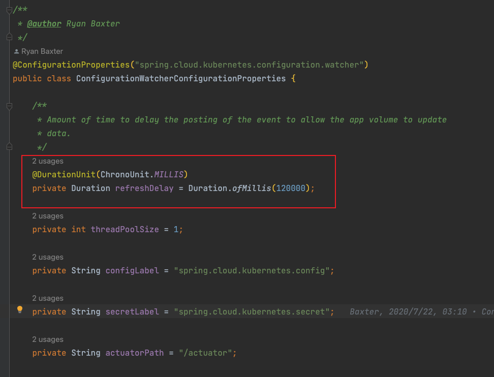

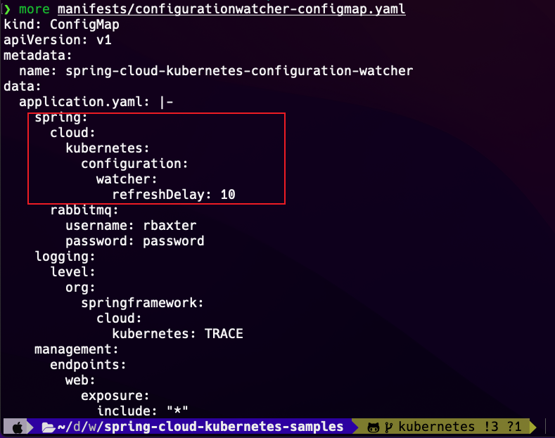

## 四、configmap-sample（服务配置刷新）

该示例演示spring cloud kubernetes从configmap、secret读取属性配置，整合spring cloud config server及Configuration Watcher做到configmap或secret内容变更不重启服务直接刷新配置。

**注意事项：**

* 该示例中使用kubernetes的原生api进行演示，它会读取本地的`~/.kube/config`文件，需提前准备好该文件，当然如果是kubernetes集群部署则可忽略。

* 因为是在本地开发，所以需要添加config client相关依赖，旨在从config server拉取应用程序配置，当然如果是kubernetes集群部署则不需要config server的存在。

### 1、pom.xml中添加依赖

```xml
        <!--
        依赖spring-cloud-kubernetes-discoveryserver组件
        <dependency>
            <groupId>org.springframework.cloud</groupId>
            <artifactId>spring-cloud-starter-kubernetes-discoveryclient</artifactId>
        </dependency>
        -->
        <!-- kubernetes原生api，会读取本机~/.kube/config文件 -->
        <dependency>
            <groupId>org.springframework.cloud</groupId>
            <artifactId>spring-cloud-starter-kubernetes-client</artifactId>
            <version>2.1.3</version>
        </dependency>
        <!-- 从configmap、secret加载应用配置文件 -->
        <dependency>
            <groupId>org.springframework.cloud</groupId>
            <artifactId>spring-cloud-starter-kubernetes-client-config</artifactId>
            <version>2.1.3</version>
        </dependency>
        <!-- spring-cloud-config-clien 从config server加载配置文件 -->
        <dependency>
            <groupId>org.springframework.cloud</groupId>
            <artifactId>spring-cloud-config-client</artifactId>
        </dependency>
        <dependency>
            <groupId>org.springframework.boot</groupId>
            <artifactId>spring-boot-starter-web</artifactId>
        </dependency>
        <dependency>
            <groupId>org.springframework.boot</groupId>
            <artifactId>spring-boot-starter-actuator</artifactId>
        </dependency>
        <dependency>
            <groupId>org.springframework.boot</groupId>
            <artifactId>spring-boot-configuration-processor</artifactId>
            <optional>true</optional>
        </dependency>
        <dependency>
            <groupId>org.projectlombok</groupId>
            <artifactId>lombok</artifactId>
            <optional>true</optional>
        </dependency>
```

###  2、配置bootstrap.yml

```yaml
server:
  port: 8080

logging:
  level:
    org.springframework.cloud.kubernetes: DEBUG

# 需对外暴露actuator
management:
  endpoint:
    health:
      show-details: always
      enabled: true
    restart:
      enabled: true
    info:
      enabled: true
  endpoints:
    web:
      exposure:
        include: '*'
#  health:
#    kubernetes:
#      enabled: false
#  info:
#    kubernetes:
#      enabled: false

spring:
  application:
    name: config-sample
  jackson:
    serialization:
      fail-on-empty-beans: false
  config:
    import: optional:configserver:http://configserver.cloudnative.io
  cloud:
    kubernetes:
      client:
        namespace: default
      enabled: true
      discovery:
        # 开启服务注册发现
        enabled: true
        # 允许访问所有namespaces
        all-namespaces: false
        include-not-ready-addresses: false

---

spring:
  config:
    activate:
      on-profile: kubernetes
      on-cloud-platform: kubernetes
    import: optional:configserver:http://spring-cloud-kubernetes-configserver:8888
```

**配置说明：**

* management.endpoint和management.endpoints部分内容为actuator的端点配置部分，主要是开放`/refresh`端点，便于Configuration Watcher感知到configmap或secret内容变化刷新应用配置。另在开发阶段我们对外暴露了所有端点便于调试观察应用程序配置等信息，在生产环境务必进行取舍。
* spring.application.name 应用程序名称，该内容应和configmap、secret的名称保持一致。
* spring.config.import:optional:configserver:http://configserver.cloudnative.io 配置从configserver导入配置信息。该属性配置是spring boot提供的功能。
* spring.cloud.kubernetes.client.namespace 配置客户端访问svc的namespace，如不配置结合下文的配置将会读取kubernetes集群中所有的服务。建议配置！
* spring.config.active 配置项等同于spring.profile.active。后者在最新版的spring boot框架中被标记为过期，不建议使用。其后面的配置项内容仅在kubernetes集群环境中生效，同理访问spring cloud config server的svc地址。

### 3、打包部署

#### 3.1 spring-boot-maven-plugin打包制作镜像

```bash
# 编译打包
❯ mvn clean package -Dmaven.test.skip=true
[INFO] Scanning for projects...
[INFO] 
[INFO] ----------------< com.cloudnative.sample:config-sample >----------------
[INFO] Building config-sample 1.1.0
[INFO] --------------------------------[ jar ]---------------------------------
[INFO] 
[INFO] --- maven-clean-plugin:3.2.0:clean (default-clean) @ config-sample ---
[INFO] Deleting /Users/amz/develop/workspace/spring-cloud-kubernetes-samples/config-sample/target
[INFO] 
[INFO] --- maven-resources-plugin:3.2.0:resources (default-resources) @ config-sample ---
[INFO] Using 'UTF-8' encoding to copy filtered resources.
[INFO] Using 'UTF-8' encoding to copy filtered properties files.
[INFO] Copying 3 resources
[INFO] Copying 1 resource
[INFO] 
[INFO] --- maven-compiler-plugin:3.10.1:compile (default-compile) @ config-sample ---
[INFO] Changes detected - recompiling the module!
[INFO] Compiling 5 source files to /Users/amz/develop/workspace/spring-cloud-kubernetes-samples/config-sample/target/classes
[INFO] 
[INFO] --- maven-resources-plugin:3.2.0:testResources (default-testResources) @ config-sample ---
[INFO] Not copying test resources
[INFO] 
[INFO] --- maven-compiler-plugin:3.10.1:testCompile (default-testCompile) @ config-sample ---
[INFO] Not compiling test sources
[INFO] 
[INFO] --- maven-surefire-plugin:2.22.2:test (default-test) @ config-sample ---
[INFO] Tests are skipped.
[INFO] 
[INFO] --- maven-jar-plugin:3.2.2:jar (default-jar) @ config-sample ---
[INFO] Building jar: /Users/amz/develop/workspace/spring-cloud-kubernetes-samples/config-sample/target/config-sample-1.1.0.jar
[INFO] 
[INFO] --- spring-boot-maven-plugin:2.7.3:repackage (repackage) @ config-sample ---
[INFO] Replacing main artifact with repackaged archive
[INFO] ------------------------------------------------------------------------
[INFO] BUILD SUCCESS
[INFO] ------------------------------------------------------------------------
[INFO] Total time:  6.373 s
[INFO] Finished at: 2022-09-14T11:38:00+08:00
[INFO] ------------------------------------------------------------------------
# 打docker镜像并推送到私服
❯ mvn spring-boot:build-image -Dmaven.test.skip=true
[INFO] Scanning for projects...
[INFO] 
[INFO] ----------------< com.cloudnative.sample:config-sample >----------------
[INFO] Building config-sample 1.1.0
[INFO] --------------------------------[ jar ]---------------------------------
[INFO] 
[INFO] >>> spring-boot-maven-plugin:2.7.3:build-image (default-cli) > package @ config-sample >>>
[INFO] 
[INFO] --- maven-resources-plugin:3.2.0:resources (default-resources) @ config-sample ---
[INFO] Using 'UTF-8' encoding to copy filtered resources.
[INFO] Using 'UTF-8' encoding to copy filtered properties files.
[INFO] Copying 3 resources
[INFO] Copying 1 resource
[INFO] 
[INFO] --- maven-compiler-plugin:3.10.1:compile (default-compile) @ config-sample ---
[INFO] Nothing to compile - all classes are up to date
[INFO] 
[INFO] --- maven-resources-plugin:3.2.0:testResources (default-testResources) @ config-sample ---
[INFO] Not copying test resources
[INFO] 
[INFO] --- maven-compiler-plugin:3.10.1:testCompile (default-testCompile) @ config-sample ---
[INFO] Not compiling test sources
[INFO] 
[INFO] --- maven-surefire-plugin:2.22.2:test (default-test) @ config-sample ---
[INFO] Tests are skipped.
[INFO] 
[INFO] --- maven-jar-plugin:3.2.2:jar (default-jar) @ config-sample ---
[INFO] 
[INFO] --- spring-boot-maven-plugin:2.7.3:repackage (repackage) @ config-sample ---
[INFO] Replacing main artifact with repackaged archive
[INFO] 
[INFO] <<< spring-boot-maven-plugin:2.7.3:build-image (default-cli) < package @ config-sample <<<
[INFO] 
[INFO] 
[INFO] --- spring-boot-maven-plugin:2.7.3:build-image (default-cli) @ config-sample ---
[INFO] Building image 'reg.anchnet.com/cloudnative/config-sample:1.1.0'
[INFO] 
[INFO]  > Executing lifecycle version v0.13.2
[INFO]  > Using build cache volume 'pack-cache-c44afd82185f.build'
[INFO] 
[INFO]  > Running creator
[INFO]     [creator]     ===> ANALYZING
[INFO]     [creator]     Restoring data for sbom from previous image
[INFO]     [creator]     ===> DETECTING
[INFO]     [creator]     6 of 19 buildpacks participating
[INFO]     [creator]     paketo-buildpacks/ca-certificates   3.0.2
[INFO]     [creator]     paketo-buildpacks/bellsoft-liberica 9.0.2
[INFO]     [creator]     paketo-buildpacks/syft              1.3.1
[INFO]     [creator]     paketo-buildpacks/executable-jar    6.0.2
[INFO]     [creator]     paketo-buildpacks/dist-zip          5.0.2
[INFO]     [creator]     paketo-buildpacks/spring-boot       5.3.0
[INFO]     [creator]     ===> RESTORING
[INFO]     [creator]     Restoring metadata for "paketo-buildpacks/ca-certificates:helper" from app image
[INFO]     [creator]     Restoring metadata for "paketo-buildpacks/bellsoft-liberica:helper" from app image
[INFO]     [creator]     Restoring metadata for "paketo-buildpacks/bellsoft-liberica:java-security-properties" from app image
[INFO]     [creator]     Restoring metadata for "paketo-buildpacks/bellsoft-liberica:jre" from app image
[INFO]     [creator]     Restoring metadata for "paketo-buildpacks/syft:syft" from cache
[INFO]     [creator]     Restoring metadata for "paketo-buildpacks/spring-boot:spring-cloud-bindings" from app image
[INFO]     [creator]     Restoring metadata for "paketo-buildpacks/spring-boot:web-application-type" from app image
[INFO]     [creator]     Restoring metadata for "paketo-buildpacks/spring-boot:helper" from app image
[INFO]     [creator]     Restoring data for "paketo-buildpacks/syft:syft" from cache
[INFO]     [creator]     Restoring data for sbom from cache
[INFO]     [creator]     ===> BUILDING
[INFO]     [creator]     
[INFO]     [creator]     Paketo CA Certificates Buildpack 3.0.2
[INFO]     [creator]       https://github.com/paketo-buildpacks/ca-certificates
[INFO]     [creator]       Launch Helper: Reusing cached layer
[INFO]     [creator]     
[INFO]     [creator]     Paketo BellSoft Liberica Buildpack 9.0.2
[INFO]     [creator]       https://github.com/paketo-buildpacks/bellsoft-liberica
[INFO]     [creator]       Build Configuration:
[INFO]     [creator]         $BP_JVM_TYPE                 JRE             the JVM type - JDK or JRE
[INFO]     [creator]         $BP_JVM_VERSION              8.*             the Java version
[INFO]     [creator]       Launch Configuration:
[INFO]     [creator]         $BPL_DEBUG_ENABLED           false           enables Java remote debugging support
[INFO]     [creator]         $BPL_DEBUG_PORT              8000            configure the remote debugging port
[INFO]     [creator]         $BPL_DEBUG_SUSPEND           false           configure whether to suspend execution until a debugger has attached
[INFO]     [creator]         $BPL_HEAP_DUMP_PATH                          write heap dumps on error to this path
[INFO]     [creator]         $BPL_JAVA_NMT_ENABLED        true            enables Java Native Memory Tracking (NMT)
[INFO]     [creator]         $BPL_JAVA_NMT_LEVEL          summary         configure level of NMT, summary or detail
[INFO]     [creator]         $BPL_JFR_ARGS                                configure custom Java Flight Recording (JFR) arguments
[INFO]     [creator]         $BPL_JFR_ENABLED             false           enables Java Flight Recording (JFR)
[INFO]     [creator]         $BPL_JMX_ENABLED             false           enables Java Management Extensions (JMX)
[INFO]     [creator]         $BPL_JMX_PORT                5000            configure the JMX port
[INFO]     [creator]         $BPL_JVM_HEAD_ROOM           0               the headroom in memory calculation
[INFO]     [creator]         $BPL_JVM_LOADED_CLASS_COUNT  35% of classes  the number of loaded classes in memory calculation
[INFO]     [creator]         $BPL_JVM_THREAD_COUNT        250             the number of threads in memory calculation
[INFO]     [creator]         $JAVA_TOOL_OPTIONS                           the JVM launch flags
[INFO]     [creator]       BellSoft Liberica JRE 8.0.312: Reusing cached layer
[INFO]     [creator]       Launch Helper: Reusing cached layer
[INFO]     [creator]       Java Security Properties: Reusing cached layer
[INFO]     [creator]     
[INFO]     [creator]     Paketo Syft Buildpack 1.3.1
[INFO]     [creator]       https://github.com/paketo-buildpacks/syft
[INFO]     [creator]     
[INFO]     [creator]     Paketo Executable JAR Buildpack 6.0.2
[INFO]     [creator]       https://github.com/paketo-buildpacks/executable-jar
[INFO]     [creator]       Class Path: Contributing to layer
[INFO]     [creator]         Writing env/CLASSPATH.delim
[INFO]     [creator]         Writing env/CLASSPATH.prepend
[INFO]     [creator]       Process types:
[INFO]     [creator]         executable-jar: java org.springframework.boot.loader.JarLauncher (direct)
[INFO]     [creator]         task:           java org.springframework.boot.loader.JarLauncher (direct)
[INFO]     [creator]         web:            java org.springframework.boot.loader.JarLauncher (direct)
[INFO]     [creator]     
[INFO]     [creator]     Paketo Spring Boot Buildpack 5.3.0
[INFO]     [creator]       https://github.com/paketo-buildpacks/spring-boot
[INFO]     [creator]       Creating slices from layers index
[INFO]     [creator]         dependencies
[INFO]     [creator]         spring-boot-loader
[INFO]     [creator]         snapshot-dependencies
[INFO]     [creator]         application
[INFO]     [creator]       Launch Helper: Reusing cached layer
[INFO]     [creator]       Spring Cloud Bindings 1.8.0: Reusing cached layer
[INFO]     [creator]       Web Application Type: Reusing cached layer
[INFO]     [creator]       4 application slices
[INFO]     [creator]       Image labels:
[INFO]     [creator]         org.opencontainers.image.title
[INFO]     [creator]         org.opencontainers.image.version
[INFO]     [creator]         org.springframework.boot.version
[INFO]     [creator]     ===> EXPORTING
[INFO]     [creator]     Reusing layer 'paketo-buildpacks/ca-certificates:helper'
[INFO]     [creator]     Reusing layer 'paketo-buildpacks/bellsoft-liberica:helper'
[INFO]     [creator]     Reusing layer 'paketo-buildpacks/bellsoft-liberica:java-security-properties'
[INFO]     [creator]     Reusing layer 'paketo-buildpacks/bellsoft-liberica:jre'
[INFO]     [creator]     Reusing layer 'paketo-buildpacks/executable-jar:classpath'
[INFO]     [creator]     Reusing layer 'paketo-buildpacks/spring-boot:helper'
[INFO]     [creator]     Reusing layer 'paketo-buildpacks/spring-boot:spring-cloud-bindings'
[INFO]     [creator]     Reusing layer 'paketo-buildpacks/spring-boot:web-application-type'
[INFO]     [creator]     Adding layer 'launch.sbom'
[INFO]     [creator]     Reusing 5/5 app layer(s)
[INFO]     [creator]     Reusing layer 'launcher'
[INFO]     [creator]     Reusing layer 'config'
[INFO]     [creator]     Reusing layer 'process-types'
[INFO]     [creator]     Adding label 'io.buildpacks.lifecycle.metadata'
[INFO]     [creator]     Adding label 'io.buildpacks.build.metadata'
[INFO]     [creator]     Adding label 'io.buildpacks.project.metadata'
[INFO]     [creator]     Adding label 'org.opencontainers.image.title'
[INFO]     [creator]     Adding label 'org.opencontainers.image.version'
[INFO]     [creator]     Adding label 'org.springframework.boot.version'
[INFO]     [creator]     Setting default process type 'web'
[INFO]     [creator]     Saving reg.anchnet.com/cloudnative/config-sample:1.1.0...
[INFO]     [creator]     *** Images (5f7286a1f97d):
[INFO]     [creator]           reg.anchnet.com/cloudnative/config-sample:1.1.0
[INFO]     [creator]     Reusing cache layer 'paketo-buildpacks/syft:syft'
[INFO]     [creator]     Reusing cache layer 'cache.sbom'
[INFO] 
[INFO] Successfully built image 'reg.anchnet.com/cloudnative/config-sample:1.1.0'
[INFO] 
[INFO]  > Pushing image 'reg.anchnet.com/cloudnative/config-sample:1.1.0' 100%
[INFO]  > Pushed image 'reg.anchnet.com/cloudnative/config-sample:1.1.0'
[INFO] ------------------------------------------------------------------------
[INFO] BUILD SUCCESS
[INFO] ------------------------------------------------------------------------
[INFO] Total time:  49.317 s
[INFO] Finished at: 2022-09-14T11:39:46+08:00
[INFO] ------------------------------------------------------------------------
```

**说明：**

* 在spring-boot 2.3版本后spring-boot-maven-plugin有一项新特性，就是可以直接打docker镜像并推送到私服。本地不需要安装docker环境，也不需要提供Dockerfile文件。

```xml
<plugin>
    <groupId>org.springframework.boot</groupId>
    <artifactId>spring-boot-maven-plugin</artifactId>
    <configuration>
      <layers>
        <enabled>true</enabled>
      </layers>
      <image>
        <name>${docker.registry.organization}/${project.artifactId}:${project.version}</name>
        <publish>true</publish>
        <pullPolicy>IF_NOT_PRESENT</pullPolicy>
      </image>
      <goal>build-image</goal>
      <docker>
        <host>tcp://172.16.62.15:2375</host>
        <tlsVerify>false</tlsVerify>
        <publishRegistry>
          <username>${env.DOCKER_USERNAME}</username>
          <password>${env.DOCKER_PASSWORD}</password>
        </publishRegistry>
      </docker>
      <pullPolicy>IF_NOT_PRESENT</pullPolicy>
    </configuration>
</plugin>
```

如上xml配置，只需要配置好远程docker地址，及环境变量中配置好docker registry的用户名密码，就可直接打包并推送。

#### 3.2 kubernetes集群部署

直接应用**k8s**目录的部署文件即可。

```bash
❯ k apply -f k8s
configmap/config-sample created
deployment.apps/config-sample created
service/config-sample created
ingress.networking.k8s.io/configsample-ingress created
serviceaccount/admin-user unchanged
clusterrolebinding.rbac.authorization.k8s.io/admin-user unchanged
secret/config-sample unchanged
❯ k get pod -owide
NAME                                                              READY   STATUS    RESTARTS   AGE     IP               NODE    NOMINATED NODE   READINESS GATES
config-sample-866487d6d7-jnb49                                    1/1     Running   0          46m     172.18.199.236   node7   <none>           <none>
nfs-client-provisioner-67cd9c9567-w8k7q                           1/1     Running   12         71d     172.18.104.4     node2   <none>           <none>
nginx-6799fc88d8-2fv2t                                            1/1     Running   0          6d22h   172.18.225.68    node8   <none>           <none>
spring-cloud-kubernetes-configserver-deployment-7d5667c44f7j9z7   1/1     Running   0          22h     172.18.104.71    node9   <none>           <none>
spring-cloud-kubernetes-configuration-watcher-deployment-5zltx9   1/1     Running   0          23h     172.18.104.69    node9   <none>           <none>
spring-cloud-kubernetes-discoveryserver-deployment-9d5d86d7lhnh   1/1     Running   0          23h     172.18.104.70    node9   <none>           <none>
❯ k get cm
NAME                                            DATA   AGE
config-sample                                   1      47m
grafana-cert-cm                                 2      19d
kube-root-ca.crt                                1      112d
kubernetesconfigserver                          1      22h
spring-cloud-kubernetes-configuration-watcher   1      23h
❯ k get svc
NAME                                            TYPE        CLUSTER-IP       EXTERNAL-IP   PORT(S)    AGE
config-sample                                   ClusterIP   10.102.84.68     <none>        8080/TCP   47m
kubernetes                                      ClusterIP   10.96.0.1        <none>        443/TCP    112d
spring-cloud-kubernetes-configserver            ClusterIP   10.109.120.151   <none>        8888/TCP   23h
spring-cloud-kubernetes-configuration-watcher   ClusterIP   10.110.146.208   <none>        8888/TCP   23h
spring-cloud-kubernetes-discoveryserver         ClusterIP   10.97.205.220    <none>        80/TCP     23h
❯ k get ingress
NAME                      CLASS    HOSTS                            ADDRESS     PORTS   AGE
configsample-ingress      <none>   configsample.cloudnative.io      localhost   80      47m
configserver-ingress      <none>   configserver.cloudnative.io      localhost   80      23h
discoveryserver-ingress   <none>   discoveryserver.cloudnative.io   localhost   80      23h
```

至此，该服务已部署完毕，接下来我们进行测试。

### 4、测试

首先查看kubernetes集群中服务注册中心中的服务情况。

```bash
❯ http discoveryserver.cloudnative.io/apps
HTTP/1.1 200 OK
Connection: keep-alive
Content-Type: application/json
Date: Wed, 14 Sep 2022 04:41:09 GMT
Transfer-Encoding: chunked

[
    {
        "name": "config-sample",
        "serviceInstances": [
            {
                "cluster": null,
                "host": "172.18.199.236",
                "instanceId": "9672c3cb-4a84-4a65-9a34-4ec0c086c330",
                "metadata": {
                    "boot.spring.io/actuator": "http://:8080/actuator",
                    "http": "8080",
                    "kubectl.kubernetes.io/last-applied-configuration": "{\"apiVersion\":\"v1\",\"kind\":\"Service\",\"metadata\":{\"annotations\":{\"boot.spring.io/actuator\":\"http://:8080/actuator\"},\"name\":\"config-sample\",\"namespace\":\"default\"},\"spec\":{\"ports\":[{\"name\":\"http\",\"port\":8080,\"targetPort\":8080}],\"selector\":{\"app\":\"config-sample\"},\"type\":\"ClusterIP\"}}\n"
                },
                "namespace": "default",
                "port": 8080,
                "scheme": "http",
                "secure": false,
                "serviceId": "config-sample",
                "uri": "http://172.18.199.236:8080"
            }
        ]
    },
    {
        "name": "spring-cloud-kubernetes-configserver",
        "serviceInstances": [
            {
                "cluster": null,
                "host": "172.18.104.71",
                "instanceId": "cbaa7e51-01d8-43f1-b7c6-f9e4d17b709f",
                "metadata": {
                    "app": "spring-cloud-kubernetes-configserver",
                    "http": "8888",
                    "kubectl.kubernetes.io/last-applied-configuration": "{\"apiVersion\":\"v1\",\"kind\":\"Service\",\"metadata\":{\"annotations\":{},\"labels\":{\"app\":\"spring-cloud-kubernetes-configserver\"},\"name\":\"spring-cloud-kubernetes-configserver\",\"namespace\":\"default\"},\"spec\":{\"ports\":[{\"name\":\"http\",\"port\":8888,\"targetPort\":8888}],\"selector\":{\"app\":\"spring-cloud-kubernetes-configserver\"},\"type\":\"ClusterIP\"}}\n"
                },
                "namespace": "default",
                "port": 8888,
                "scheme": "http",
                "secure": false,
                "serviceId": "spring-cloud-kubernetes-configserver",
                "uri": "http://172.18.104.71:8888"
            }
        ]
    },
    {
        "name": "spring-cloud-kubernetes-configuration-watcher",
        "serviceInstances": [
            {
                "cluster": null,
                "host": "172.18.104.69",
                "instanceId": "402de4ed-89b3-43c7-be8b-e8e892c4cc9f",
                "metadata": {
                    "app": "spring-cloud-kubernetes-configuration-watcher",
                    "http": "8888",
                    "kubectl.kubernetes.io/last-applied-configuration": "{\"apiVersion\":\"v1\",\"kind\":\"Service\",\"metadata\":{\"annotations\":{},\"labels\":{\"app\":\"spring-cloud-kubernetes-configuration-watcher\"},\"name\":\"spring-cloud-kubernetes-configuration-watcher\",\"namespace\":\"default\"},\"spec\":{\"ports\":[{\"name\":\"http\",\"port\":8888,\"targetPort\":8888}],\"selector\":{\"app\":\"spring-cloud-kubernetes-configuration-watcher\"},\"type\":\"ClusterIP\"}}\n"
                },
                "namespace": "default",
                "port": 8888,
                "scheme": "http",
                "secure": false,
                "serviceId": "spring-cloud-kubernetes-configuration-watcher",
                "uri": "http://172.18.104.69:8888"
            }
        ]
    },
    {
        "name": "spring-cloud-kubernetes-discoveryserver",
        "serviceInstances": [
            {
                "cluster": null,
                "host": "172.18.104.70",
                "instanceId": "c953b710-9e81-4a62-9f02-7a4184f59520",
                "metadata": {
                    "app": "spring-cloud-kubernetes-discoveryserver",
                    "http": "8761",
                    "kubectl.kubernetes.io/last-applied-configuration": "{\"apiVersion\":\"v1\",\"kind\":\"Service\",\"metadata\":{\"annotations\":{},\"labels\":{\"app\":\"spring-cloud-kubernetes-discoveryserver\"},\"name\":\"spring-cloud-kubernetes-discoveryserver\",\"namespace\":\"default\"},\"spec\":{\"ports\":[{\"name\":\"http\",\"port\":80,\"targetPort\":8761}],\"selector\":{\"app\":\"spring-cloud-kubernetes-discoveryserver\"},\"type\":\"ClusterIP\"}}\n"
                },
                "namespace": "default",
                "port": 8761,
                "scheme": "http",
                "secure": false,
                "serviceId": "spring-cloud-kubernetes-discoveryserver",
                "uri": "http://172.18.104.70:8761"
            }
        ]
    },
    {
        "name": "kubernetes",
        "serviceInstances": [
            {
                "cluster": null,
                "host": "192.168.101.20",
                "instanceId": "",
                "metadata": {
                    "component": "apiserver",
                    "https": "6443",
                    "provider": "kubernetes"
                },
                "namespace": "default",
                "port": 6443,
                "scheme": "http",
                "secure": false,
                "serviceId": "kubernetes",
                "uri": "http://192.168.101.20:6443"
            },
            {
                "cluster": null,
                "host": "192.168.101.22",
                "instanceId": "",
                "metadata": {
                    "component": "apiserver",
                    "https": "6443",
                    "provider": "kubernetes"
                },
                "namespace": "default",
                "port": 6443,
                "scheme": "http",
                "secure": false,
                "serviceId": "kubernetes",
                "uri": "http://192.168.101.22:6443"
            },
            {
                "cluster": null,
                "host": "192.168.101.24",
                "instanceId": "",
                "metadata": {
                    "component": "apiserver",
                    "https": "6443",
                    "provider": "kubernetes"
                },
                "namespace": "default",
                "port": 6443,
                "scheme": "http",
                "secure": false,
                "serviceId": "kubernetes",
                "uri": "http://192.168.101.24:6443"
            }
        ]
    }
]
```

接下来查看服务配置中心中的配置情况：

* kubernetes profile

```bash
❯ http configserver.cloudnative.io/config-sample/kubernetes
HTTP/1.1 200 
Connection: keep-alive
Content-Type: application/json
Date: Wed, 14 Sep 2022 04:42:49 GMT
Transfer-Encoding: chunked

{
    "label": null,
    "name": "config-sample",
    "profiles": [
        "kubernetes"
    ],
    "propertySources": [
        {
            "name": "configmap.config-sample.default",
            "source": {
                "greeting.message": "HelloWorld! --- from ConfigMap kubernetes profile 444",
                "spring.cloud.config.profile": "kubernetes",
                "spring.config.activate.on-profile": "kubernetes"
            }
        },
        {
            "name": "secrets.config-sample.default",
            "source": {
                "secret.password": "Jiaduobao886",
                "secret.username": "admin"
            }
        },
        {
            "name": "https://github.com/ryanjbaxter/s1-2021-config/Config resource 'file [/tmp/config-repo-861021739807758125/application.yaml' via location '' (document #1)",
            "source": {
                "eureka.client.enabled": false,
                "spring.cloud.kubernetes.enabled": true,
                "spring.config.activate.on-cloud-platform": "kubernetes"
            }
        },
        {
            "name": "https://github.com/ryanjbaxter/s1-2021-config/Config resource 'file [/tmp/config-repo-861021739807758125/application.yaml' via location '' (document #0)",
            "source": {
                "chaos.monkey.assaults.latency-active": true,
                "chaos.monkey.assaults.level": 3,
                "chaos.monkey.enabled": false,
                "chaos.monkey.watcher.restController": true,
                "chaos.monkey.watcher.service": false,
                "eureka.client.serviceUrl.defaultZone": "http://localhost:8761/eureka/",
                "management.endpoint.chaosmonkey.enabled": true,
                "management.endpoint.health.show-details": "always",
                "management.endpoint.restart.enabled": true,
                "management.endpoints.web.exposure.include": "*",
                "spring.cloud.kubernetes.enabled": false
            }
        }
    ],
    "state": null,
    "version": null
}
```

* local profile

```bash
❯ http configserver.cloudnative.io/config-sample/local
HTTP/1.1 200 
Connection: keep-alive
Content-Type: application/json
Date: Wed, 14 Sep 2022 04:43:53 GMT
Transfer-Encoding: chunked

{
    "label": null,
    "name": "config-sample",
    "profiles": [
        "local"
    ],
    "propertySources": [
        {
            "name": "configmap.config-sample.default",
            "source": {
                "greeting.message": "HelloWorld! --- from ConfigMap local profile 222",
                "spring.cloud.config.profile": "kubernetes",
                "spring.config.activate.on-profile": "local"
            }
        },
        {
            "name": "secrets.config-sample.default",
            "source": {
                "secret.password": "Jiaduobao886",
                "secret.username": "admin"
            }
        },
        {
            "name": "https://github.com/ryanjbaxter/s1-2021-config/Config resource 'file [/tmp/config-repo-861021739807758125/application.yaml' via location '' (document #1)",
            "source": {
                "eureka.client.enabled": false,
                "spring.cloud.kubernetes.enabled": true,
                "spring.config.activate.on-cloud-platform": "kubernetes"
            }
        },
        {
            "name": "https://github.com/ryanjbaxter/s1-2021-config/Config resource 'file [/tmp/config-repo-861021739807758125/application.yaml' via location '' (document #0)",
            "source": {
                "chaos.monkey.assaults.latency-active": true,
                "chaos.monkey.assaults.level": 3,
                "chaos.monkey.enabled": false,
                "chaos.monkey.watcher.restController": true,
                "chaos.monkey.watcher.service": false,
                "eureka.client.serviceUrl.defaultZone": "http://localhost:8761/eureka/",
                "management.endpoint.chaosmonkey.enabled": true,
                "management.endpoint.health.show-details": "always",
                "management.endpoint.restart.enabled": true,
                "management.endpoints.web.exposure.include": "*",
                "spring.cloud.kubernetes.enabled": false
            }
        }
    ],
    "state": null,
    "version": null
}
```

具体访问路径格式遵循如下规则：

```
http://{config-server}:{port}/{applicationname}/{profile}
```

我们可以看到可以成功从configmap、secret及远程git仓库读取配置文件。

#### 4.1、kubernetes环境服务测试

###### 4.1.1 读取configmap

```bash
❯ http configsample.cloudnative.io/configmap/env
HTTP/1.1 200 
Connection: keep-alive
Content-Length: 53
Content-Type: text/plain;charset=UTF-8
Date: Wed, 14 Sep 2022 04:47:45 GMT

HelloWorld! --- from ConfigMap kubernetes profile 444


❯ http configsample.cloudnative.io/configmap/properties
HTTP/1.1 200 
Connection: keep-alive
Content-Length: 53
Content-Type: text/plain;charset=UTF-8
Date: Wed, 14 Sep 2022 04:47:47 GMT

HelloWorld! --- from ConfigMap kubernetes profile 444


❯ http configsample.cloudnative.io/configmap/value
HTTP/1.1 200 
Connection: keep-alive
Content-Length: 53
Content-Type: text/plain;charset=UTF-8
Date: Wed, 14 Sep 2022 04:47:52 GMT

HelloWorld! --- from ConfigMap kubernetes profile 444
```

以上接口分别对应如下的代码：

```java
@RestController
@RequestMapping("/configmap")
public class ConfigMapController {

    @Value("${greeting.message}")
    private String message;

    @Autowired
    private ConfigMapRead configMapRead;

    @Autowired
    private Environment environment;

    @GetMapping("/value")
    public String value() {
        return message;
    }

    @GetMapping("/properties")
    public String properties() {
        return configMapRead.getMessage();
    }

    @GetMapping("/env")
    public String env() {
        return environment.getProperty("greeting.message");
    }

}
```

可见均可以正常加载。

###### 4.1.2 读取secret

```bash
❯ http configsample.cloudnative.io/secret/env
HTTP/1.1 200 
Connection: keep-alive
Content-Length: 18
Content-Type: text/plain;charset=UTF-8
Date: Wed, 14 Sep 2022 04:49:31 GMT

admin|Jiaduobao886


❯ http configsample.cloudnative.io/secret/properties
HTTP/1.1 200 
Connection: keep-alive
Content-Length: 18
Content-Type: text/plain;charset=UTF-8
Date: Wed, 14 Sep 2022 04:49:34 GMT

admin|Jiaduobao886


❯ http configsample.cloudnative.io/secret/value
HTTP/1.1 200 
Connection: keep-alive
Content-Length: 18
Content-Type: text/plain;charset=UTF-8
Date: Wed, 14 Sep 2022 04:49:39 GMT

admin|Jiaduobao886
```

以上接口分别对应如下的代码：

```java
@RestController
@RequestMapping("/secret")
public class SecretController {

    @Value("${secret.username}")
    private String username;

    @Value("${secret.password}")
    private String password;

    @Autowired
    private SecretRead secretRead;

    @Autowired
    private Environment environment;

    @GetMapping("/value")
    public String value() {
        return username + "|" + password;
    }

    @GetMapping("/properties")
    public String properties() {
        return secretRead.getUsername() + "|" + secretRead.getPassword();
    }

    @GetMapping("/env")
    public String env() {
        return environment.getProperty("secret.username") + "|" + environment.getProperty("secret.password");
    }

}
```

###### 4.1.3 获取服务列表

```bash
❯ http configsample.cloudnative.io/
HTTP/1.1 200 
Connection: keep-alive
Content-Type: application/json
Date: Wed, 14 Sep 2022 05:07:51 GMT
Transfer-Encoding: chunked

{
    "config-sample": [
        {
            "cluster": null,
            "host": "172.18.199.236",
            "instanceId": "9672c3cb-4a84-4a65-9a34-4ec0c086c330",
            "metadata": {
                "boot.spring.io/actuator": "http://:8080/actuator",
                "http": "8080",
                "kubectl.kubernetes.io/last-applied-configuration": "{\"apiVersion\":\"v1\",\"kind\":\"Service\",\"metadata\":{\"annotations\":{\"boot.spring.io/actuator\":\"http://:8080/actuator\"},\"name\":\"config-sample\",\"namespace\":\"default\"},\"spec\":{\"ports\":[{\"name\":\"http\",\"port\":8080,\"targetPort\":8080}],\"selector\":{\"app\":\"config-sample\"},\"type\":\"ClusterIP\"}}\n"
            },
            "namespace": "default",
            "port": 8080,
            "scheme": "http",
            "secure": false,
            "serviceId": "config-sample",
            "uri": "http://172.18.199.236:8080"
        }
    ],
    "kubernetes": [
        {
            "cluster": null,
            "host": "192.168.101.20",
            "instanceId": "",
            "metadata": {
                "component": "apiserver",
                "https": "6443",
                "provider": "kubernetes"
            },
            "namespace": "default",
            "port": 6443,
            "scheme": "http",
            "secure": false,
            "serviceId": "kubernetes",
            "uri": "http://192.168.101.20:6443"
        },
        {
            "cluster": null,
            "host": "192.168.101.22",
            "instanceId": "",
            "metadata": {
                "component": "apiserver",
                "https": "6443",
                "provider": "kubernetes"
            },
            "namespace": "default",
            "port": 6443,
            "scheme": "http",
            "secure": false,
            "serviceId": "kubernetes",
            "uri": "http://192.168.101.22:6443"
        },
        {
            "cluster": null,
            "host": "192.168.101.24",
            "instanceId": "",
            "metadata": {
                "component": "apiserver",
                "https": "6443",
                "provider": "kubernetes"
            },
            "namespace": "default",
            "port": 6443,
            "scheme": "http",
            "secure": false,
            "serviceId": "kubernetes",
            "uri": "http://192.168.101.24:6443"
        }
    ],
    "spring-cloud-kubernetes-configserver": [
        {
            "cluster": null,
            "host": "172.18.104.71",
            "instanceId": "cbaa7e51-01d8-43f1-b7c6-f9e4d17b709f",
            "metadata": {
                "app": "spring-cloud-kubernetes-configserver",
                "http": "8888",
                "kubectl.kubernetes.io/last-applied-configuration": "{\"apiVersion\":\"v1\",\"kind\":\"Service\",\"metadata\":{\"annotations\":{},\"labels\":{\"app\":\"spring-cloud-kubernetes-configserver\"},\"name\":\"spring-cloud-kubernetes-configserver\",\"namespace\":\"default\"},\"spec\":{\"ports\":[{\"name\":\"http\",\"port\":8888,\"targetPort\":8888}],\"selector\":{\"app\":\"spring-cloud-kubernetes-configserver\"},\"type\":\"ClusterIP\"}}\n"
            },
            "namespace": "default",
            "port": 8888,
            "scheme": "http",
            "secure": false,
            "serviceId": "spring-cloud-kubernetes-configserver",
            "uri": "http://172.18.104.71:8888"
        }
    ],
    "spring-cloud-kubernetes-configuration-watcher": [
        {
            "cluster": null,
            "host": "172.18.104.69",
            "instanceId": "402de4ed-89b3-43c7-be8b-e8e892c4cc9f",
            "metadata": {
                "app": "spring-cloud-kubernetes-configuration-watcher",
                "http": "8888",
                "kubectl.kubernetes.io/last-applied-configuration": "{\"apiVersion\":\"v1\",\"kind\":\"Service\",\"metadata\":{\"annotations\":{},\"labels\":{\"app\":\"spring-cloud-kubernetes-configuration-watcher\"},\"name\":\"spring-cloud-kubernetes-configuration-watcher\",\"namespace\":\"default\"},\"spec\":{\"ports\":[{\"name\":\"http\",\"port\":8888,\"targetPort\":8888}],\"selector\":{\"app\":\"spring-cloud-kubernetes-configuration-watcher\"},\"type\":\"ClusterIP\"}}\n"
            },
            "namespace": "default",
            "port": 8888,
            "scheme": "http",
            "secure": false,
            "serviceId": "spring-cloud-kubernetes-configuration-watcher",
            "uri": "http://172.18.104.69:8888"
        }
    ],
    "spring-cloud-kubernetes-discoveryserver": [
        {
            "cluster": null,
            "host": "172.18.104.70",
            "instanceId": "c953b710-9e81-4a62-9f02-7a4184f59520",
            "metadata": {
                "app": "spring-cloud-kubernetes-discoveryserver",
                "http": "8761",
                "kubectl.kubernetes.io/last-applied-configuration": "{\"apiVersion\":\"v1\",\"kind\":\"Service\",\"metadata\":{\"annotations\":{},\"labels\":{\"app\":\"spring-cloud-kubernetes-discoveryserver\"},\"name\":\"spring-cloud-kubernetes-discoveryserver\",\"namespace\":\"default\"},\"spec\":{\"ports\":[{\"name\":\"http\",\"port\":80,\"targetPort\":8761}],\"selector\":{\"app\":\"spring-cloud-kubernetes-discoveryserver\"},\"type\":\"ClusterIP\"}}\n"
            },
            "namespace": "default",
            "port": 8761,
            "scheme": "http",
            "secure": false,
            "serviceId": "spring-cloud-kubernetes-discoveryserver",
            "uri": "http://172.18.104.70:8761"
        }
    ]
}
```

其对应的代码如下：

```java
    @Autowired
    private DiscoveryClient discoveryClient;

    @GetMapping("/")
    public Object index() {
        Map<String, Object> map = new TreeMap<>();
        discoveryClient.getServices().forEach(serviceId -> map.put(serviceId, discoveryClient.getInstances(serviceId)));
        return map;
    }
```

###### 4.1.4 访问/actuator端点

* /actuator/info

```bash
❯ http configsample.cloudnative.io/actuator/info
HTTP/1.1 200 
Connection: keep-alive
Content-Type: application/vnd.spring-boot.actuator.v3+json
Date: Wed, 14 Sep 2022 05:18:34 GMT
Transfer-Encoding: chunked

{
    "kubernetes": {
        "hostIp": "192.168.101.86",
        "inside": true,
        "namespace": "default",
        "nodeName": "node7",
        "podIp": "172.18.199.236",
        "podName": "config-sample-866487d6d7-jnb49",
        "serviceAccount": "admin-user"
    }
}
```

* /actuator/configprops

内容太多，略去

* /actuator/health

```bash
❯ http configsample.cloudnative.io/actuator/health
HTTP/1.1 200 
Connection: keep-alive
Content-Type: application/vnd.spring-boot.actuator.v3+json
Date: Wed, 14 Sep 2022 05:19:57 GMT
Transfer-Encoding: chunked

{
    "components": {
        "clientConfigServer": {
            "details": {
                "propertySources": [
                    "bootstrapProperties-configClient",
                    "bootstrapProperties-configmap.config-sample.default",
                    "bootstrapProperties-secrets.config-sample.default",
                    "bootstrapProperties-https://github.com/ryanjbaxter/s1-2021-config/Config resource 'file [/tmp/config-repo-861021739807758125/application.yaml' via location '' (document #1)",
                    "bootstrapProperties-https://github.com/ryanjbaxter/s1-2021-config/Config resource 'file [/tmp/config-repo-861021739807758125/application.yaml' via location '' (document #0)",
                    "configserver:configmap.config-sample.default",
                    "configserver:secrets.config-sample.default",
                    "configserver:https://github.com/ryanjbaxter/s1-2021-config/Config resource 'file [/tmp/config-repo-861021739807758125/application.yaml' via location '' (document #1)",
                    "configserver:https://github.com/ryanjbaxter/s1-2021-config/Config resource 'file [/tmp/config-repo-861021739807758125/application.yaml' via location '' (document #0)",
                    "configClient"
                ]
            },
            "status": "UP"
        },
        "discoveryComposite": {
            "components": {
                "discoveryClient": {
                    "details": {
                        "services": [
                            "config-sample",
                            "spring-cloud-kubernetes-configuration-watcher",
                            "spring-cloud-kubernetes-configserver",
                            "spring-cloud-kubernetes-discoveryserver",
                            "kubernetes"
                        ]
                    },
                    "status": "UP"
                }
            },
            "status": "UP"
        },
        "diskSpace": {
            "details": {
                "exists": true,
                "free": 317222281216,
                "threshold": 10485760,
                "total": 321883471872
            },
            "status": "UP"
        },
        "kubernetes": {
            "details": {
                "hostIp": "192.168.101.86",
                "inside": true,
                "labels": {
                    "app": "config-sample",
                    "pod-template-hash": "866487d6d7"
                },
                "namespace": "default",
                "nodeName": "node7",
                "podIp": "172.18.199.236",
                "podName": "config-sample-866487d6d7-jnb49",
                "serviceAccount": "admin-user"
            },
            "status": "UP"
        },
        "livenessState": {
            "status": "UP"
        },
        "ping": {
            "status": "UP"
        },
        "readinessState": {
            "status": "UP"
        },
        "refreshScope": {
            "status": "UP"
        }
    },
    "groups": [
        "liveness",
        "readiness"
    ],
    "status": "UP"
}
```


#### 4.2 本地环境测试

启动本地代码，启动时设置profile为local进行测试，注意观察启动日志。

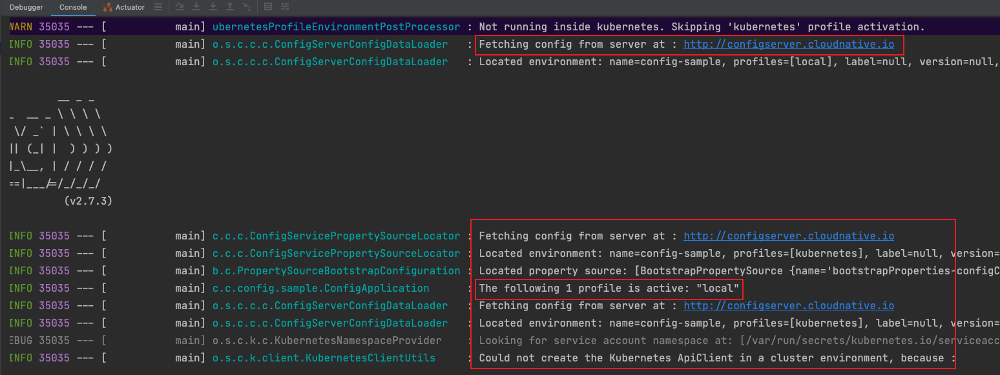


通过启动日志我们发现：

1、程序以`local` profile 启动，访问了远程config server，从远端config server加载了配置信息；

2、程序尝试使用`standard`配置创建Kubernetes ApiClient；

3、程序读取了`$KUBECONFIG` 或 `$HOME/.kube/config`文件，当然本次启动是读取了`$HOME/.kube/config`文件；

4、程序使用了kubernetes官方提供的原生api sdk `io.kubernetes.client`；

5、程序从kubernetes集群中发现了5个服务。

6、程序对外暴露了18个`actuator`端点。


### 5、热更新

#### 5.1、 kubernetes集群环境

##### 5.1.1 configmap热更新

测试前首先查看configmap的值如下：

```bash
❯ http configsample.cloudnative.io/configmap/value
HTTP/1.1 200 
Connection: keep-alive
Content-Length: 53
Content-Type: text/plain;charset=UTF-8
Date: Wed, 14 Sep 2022 05:23:51 GMT

HelloWorld! --- from ConfigMap kubernetes profile 444
```

修改configmap，将444修改为555，并应用部署

```bash
❯ k apply -f k8s/configmap.yml
configmap/config-sample configured
```

* 观察Configuration Watcher日志输出：

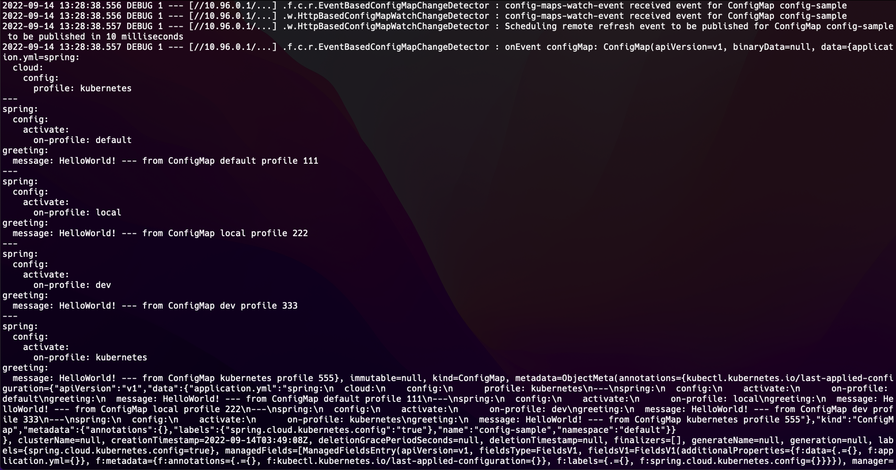
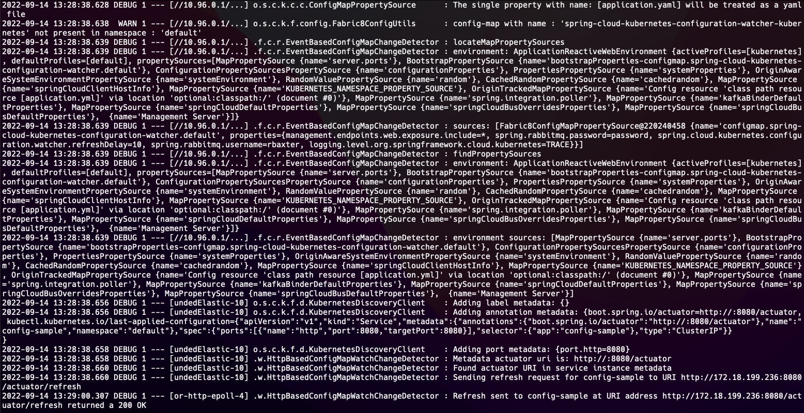

Configuration Watcher监听到configmap内容变更，并向目标应用程序发起了`/actuator/refresh`请求。

* 观察应用程序config-sample日志输出：

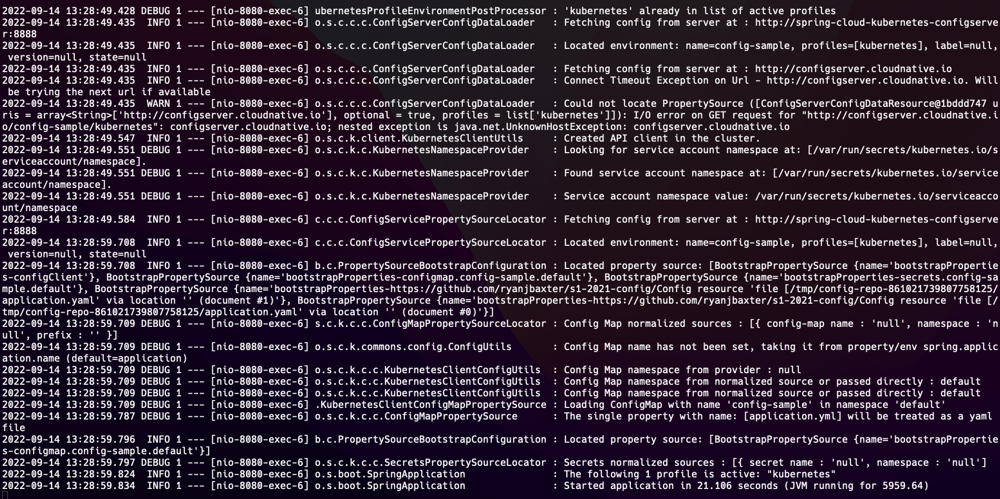

应用程序已经感知到配置变更进行了reload。

* 访问应用程序

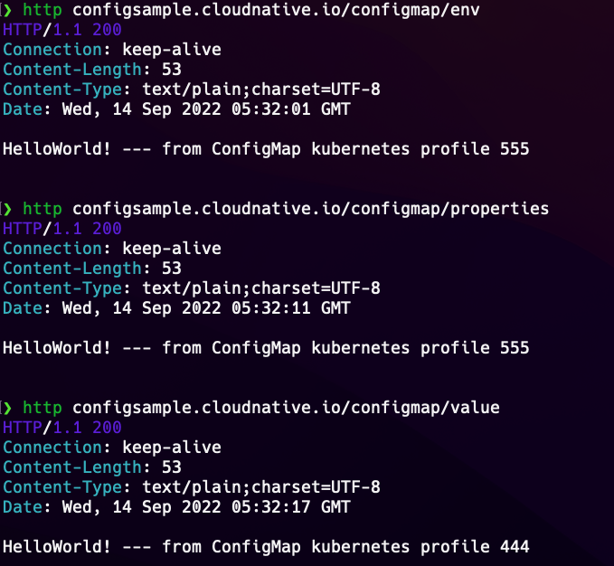

可见，除了**value**方式外，其他两种模式配置均已更新为最新值。

##### 5.1.2 secret热更新

测试前首先查看secret的值如下：

```bash
❯ http configsample.cloudnative.io/secret/value
HTTP/1.1 200 
Connection: keep-alive
Content-Length: 18
Content-Type: text/plain;charset=UTF-8
Date: Wed, 14 Sep 2022 05:41:43 GMT

admin|Jiaduobao886
```

修改secret，将Jiaduobao886修改为Wanglaoji886，并应用部署

```bash
❯ k apply -f k8s/secret.yml
secret/config-sample configured
```

* 观察Configuration Watcher日志输出：

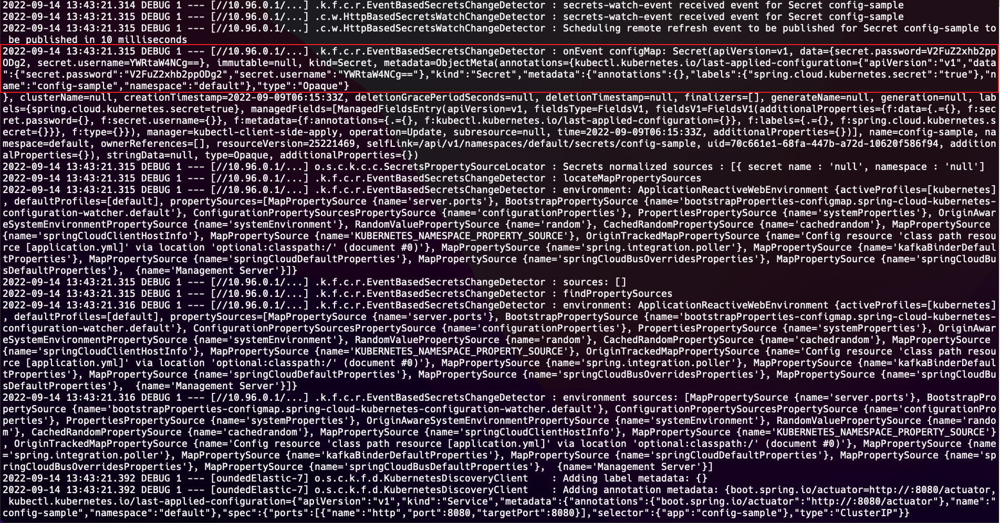
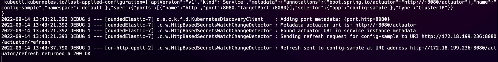

Configuration Watcher监听到configmap内容变更，并向目标应用程序发起了`/actuator/refresh`请求。

* 观察应用程序config-sample日志输出：

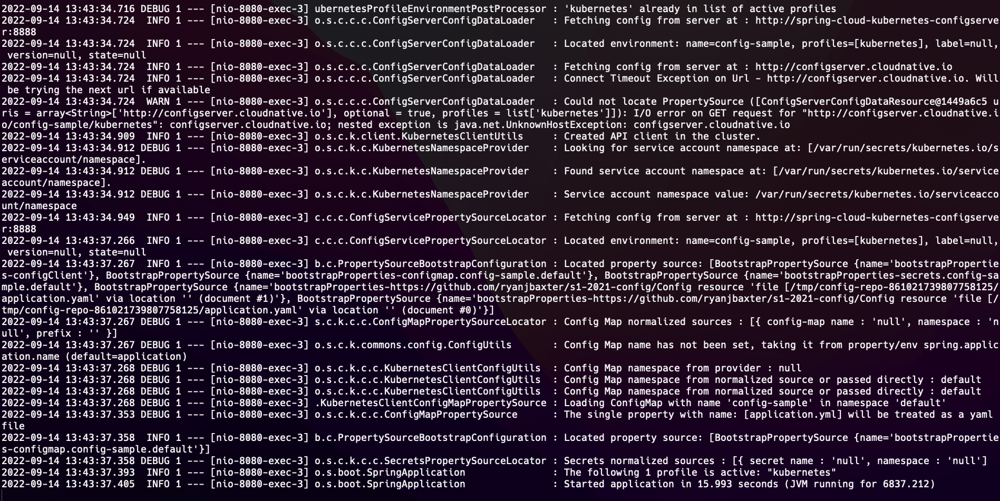

应用程序已经感知到配置变更进行了reload。

* 访问应用程序

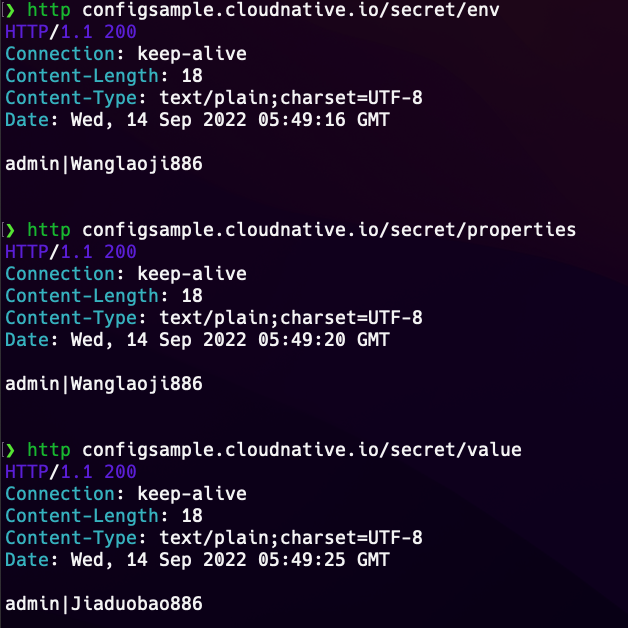

可见，除了**value**方式外，其他两种模式配置均已更新为最新值。


#### 5.2 本地环境


**若程序在本地模式启动，configmap、secret即使内容发生变更，程序自身内容不会立即生效。这个很好理解，因为`/actuator/refresh`是由`Configuration Watcher`来触发，而`Configuration Watcher`部署在kubernetes集群内部，它的网络和你本地的网络是不通的，所以没法发起该请求刷新配置。本地只需要重新启动服务即可从configmap、secret中读取到最新的配置。**


### 6、configmap、secret删除测试

删除前先查看configmap、secret中的值如下所示：

```bash
❯ http configsample.cloudnative.io/configmap/env
HTTP/1.1 200 
Connection: keep-alive
Content-Length: 53
Content-Type: text/plain;charset=UTF-8
Date: Wed, 14 Sep 2022 05:58:31 GMT

HelloWorld! --- from ConfigMap kubernetes profile 444

❯ http configsample.cloudnative.io/secret/env
HTTP/1.1 200 
Connection: keep-alive
Content-Length: 18
Content-Type: text/plain;charset=UTF-8
Date: Wed, 14 Sep 2022 05:58:23 GMT

admin|Jiaduobao886
```

接下来删除configmap、secret

```bash
❯ k delete cm config-sample
configmap "config-sample" deleted
❯ k delete secret config-sample
secret "config-sample" deleted
```

我们会发现Configuration Watcher和应用程序自身都感知到了此次内容变化。接下来我们再次访问configmap、secret观察其输出如下：

```bash
❯ http configsample.cloudnative.io/configmap/env
HTTP/1.1 200 
Connection: keep-alive
Content-Length: 53
Content-Type: text/plain;charset=UTF-8
Date: Wed, 14 Sep 2022 06:01:28 GMT

HelloWorld! --- from ConfigMap kubernetes profile 444


❯ http configsample.cloudnative.io/secret/env
HTTP/1.1 200 
Connection: keep-alive
Content-Length: 18
Content-Type: text/plain;charset=UTF-8
Date: Wed, 14 Sep 2022 06:01:34 GMT

admin|Jiaduobao886
```

我们神奇的发现获取到的值还是原来的值。由此可以推测，当不小心误删除configmap、secret时，只有不手动重启应用程序，程序中仍能读取到删除前的值。

## 五、discovery-sample（服务发现、feign调用、负载均衡）

该示例演示spring cloud kubernetes使用`spring-cloud-starter-kubernetes-discoveryclient`配合`spring-cloud-kubernetes-discoveryserver`组件在没有`~/.kube/config`文件的情况下整合kubernetes做服务注册发现。该模式适用于本地开发环境，大多数场景下，由于开发环境安全或网络限制，不可能所有人能拿到`~/.kube/config`文件，此时如采用前文中使用的`spring-cloud-starter-kubernetes-client`那是没办法在本地开展工作的。因此该示例演示了该场景下该如何进行开发及调用线上kubernetes服务，只需要确保本地环境和kubernetes集群在同一个局域网内即可。

### 1、pom.xml中添加依赖

```xml
        <!-- 依赖spring-cloud-kubernetes-discoveryserver组件，直接与其通信，不需要本地存在 ~/.kube/config文件 -->
        <dependency>
            <groupId>org.springframework.cloud</groupId>
            <artifactId>spring-cloud-starter-kubernetes-discoveryclient</artifactId>
            <version>2.1.3</version>
        </dependency>
        <!-- 从configmap、secret加载应用配置文件 -->
        <dependency>
            <groupId>org.springframework.cloud</groupId>
            <artifactId>spring-cloud-starter-kubernetes-client-config</artifactId>
            <version>2.1.3</version>
        </dependency>
        <!-- spring-cloud-config-clien 从config server加载配置文件 -->
        <dependency>
            <groupId>org.springframework.cloud</groupId>
            <artifactId>spring-cloud-config-client</artifactId>
        </dependency>
        <!--
        <dependency>
            <groupId>org.springframework.cloud</groupId>
            <artifactId>spring-cloud-starter-kubernetes-client-loadbalancer</artifactId>
            <version>2.1.3</version>
        </dependency>
        -->
        <!-- loadbalancer组件，不建议使用spring-cloud-starter-kubernetes-client-loadbalancer组件，该组件仍然会使用本地~/.kube/config文件进行通信 -->
        <dependency>
            <groupId>org.springframework.cloud</groupId>
            <artifactId>spring-cloud-starter-loadbalancer</artifactId>
        </dependency>
        <dependency>
            <groupId>org.springframework.cloud</groupId>
            <artifactId>spring-cloud-starter-openfeign</artifactId>
        </dependency>
        <dependency>
            <groupId>org.springframework.boot</groupId>
            <artifactId>spring-boot-starter-actuator</artifactId>
        </dependency>
        <dependency>
            <groupId>org.springframework.boot</groupId>
            <artifactId>spring-boot-starter-web</artifactId>
        </dependency>
```

**依赖说明：**

* spring-cloud-starter-kubernetes-discoveryclient配合spring-cloud-kubernetes-discoveryserver使用，需事先在kubernetes集群中部署好spring-cloud-kubernetes-discoveryserver服务，并创建好ingress供外部调用。
* spring-cloud-starter-kubernetes-client-config 从configmap、secret加载应用配置文件
* spring-cloud-config-client 从config server加载配置文件
* spring-cloud-starter-loadbalancer loadbalancer组件，不建议使用spring-cloud-starter-kubernetes-client-loadbalancer组件，该组件仍然会使用本地~/.kube/config文件进行通信
* spring-cloud-starter-openfeign 创建feign client
* spring-boot-starter-actuator 提供`/actuator`端点

### 2、配置bootstrap.yml

application.yml 该文件放一些通用配置类信息

```yaml
server:
  port: 9080

spring:
  main:
    allow-bean-definition-overriding: true
  application:
    name: discovery-sample
  jackson:
    serialization:
      fail-on-empty-beans: false

management:
  endpoint:
    health:
      show-details: always
      enabled: true
    restart:
      enabled: true
    info:
      enabled: true
  endpoints:
    web:
      exposure:
        include: '*'
#  health:
#    kubernetes:
#      enabled: false
#  info:
#    kubernetes:
#      enabled: false

logging:
  level:
    org.springframework.cloud.kubernetes: DEBUG
    org.springframework.cloud.openfeign: TRACE
```

bootstrap-local.yml 本地模式启动时的配置文件

```yaml
spring:
  config:
    activate:
      on-profile: local
    import: optional:configserver:http://configserver.cloudnative.io
  cloud:
    loadbalancer:
      enabled: true
      ribbon:
        enabled: false
    kubernetes:
      enabled: true
      config:
        name: discovery-sample
        namespace: default
        enabled: true
        enable-api: true
      secrets:
        name: discovery-sample
        namespace: default
        enabled: true
        enable-api: true
      reload:
        enabled: true
        mode: event
        strategy: refresh
        monitoring-config-maps: true
        monitoring-secrets: true
      loadbalancer:
        enabled: true
        mode: SERVICE
      discovery:
        # 开启服务注册发现
        enabled: true
        # 允许访问所有namespaces
        all-namespaces: true
        include-not-ready-addresses: false
        discovery-server-url: http://discoveryserver.cloudnative.io

#feign:
#  client:
#    config-sample-url: http://configsample.cloudnative.io
#    weibo-service-url: http://weiboservice.cloudnative.io
#    weather-service-url: http://weatherservice.cloudnative.io
```

bootstrap-kubernetes.yml kubernetes集群模式启动时的配置文件

```yaml
spring:
  config:
    activate:
      on-profile: kubernetes
    import: optional:configserver:http://spring-cloud-kubernetes-configserver:8888
  cloud:
    loadbalancer:
      enabled: true
      ribbon:
        enabled: false
    kubernetes:
      enabled: true
      config:
        name: discovery-sample
        namespace: default
        enabled: true
        enable-api: true
      secrets:
        name: discovery-sample
        namespace: default
        enabled: true
        enable-api: true
      reload:
        enabled: true
        mode: event
        strategy: refresh
        monitoring-config-maps: true
        monitoring-secrets: true
      loadbalancer:
        enabled: true
        mode: SERVICE
      discovery:
        # 开启服务注册发现
        enabled: true
        # 允许访问所有namespaces
        all-namespaces: true
        include-not-ready-addresses: false
        discovery-server-url: http://spring-cloud-kubernetes-discoveryserver

#feign:
#  client:
#    config-sample-url: http://config-sample:8080
#    weibo-service-url: http://weibo-service:5000
#    weather-service-url: http://weather-service:8080
```

**配置文件说明：**

* spring.config.import部分的配置分别从ingress或集群内svc访问configserver加载应用配置文件；
* spring.cloud.loadbalancer 部分配置是和loadbalancer相关的配置
* spring.cloud.kubernetes.config 应用读取configmap的配置
* spring.cloud.kubernetes.secrets 应用读取secrets的配置
* spring.cloud.kubernetes.reload configmap、secret热加载配置
* spring.cloud.kubernetes.loadbalancer 部分配置，有SERVICE、POD两种模式
* spring.cloud.kubernetes.discovery kubernetes服务发现部分配置，discovery-server-url为`spring-cloud-kubernetes-discoveryserver`组件的访问地址。


**注意：在使用`spring-cloud-starter-kubernetes-discoveryclient`模式时，configmap、secrets、reload部分的配置项均需要显式声明配置，否则热更新不生效。**

### 3、打包部署

```bash
❯ mvn clean package -Dmaven.test.skip=true
❯ mvn spring-boot:build-image -Dmaven.test.skip=true
❯ k apply -f k8s
configmap/discovery-sample created
deployment.apps/discovery-sample created
service/discovery-sample created
ingress.networking.k8s.io/discoverysample-ingress created
serviceaccount/admin-user unchanged
clusterrolebinding.rbac.authorization.k8s.io/admin-user unchanged
secret/discovery-sample unchanged
❯ k get pod -owide
NAME                                                              READY   STATUS    RESTARTS   AGE    IP               NODE    NOMINATED NODE   READINESS GATES
config-sample-866487d6d7-jnb49                                    1/1     Running   0          171m   172.18.199.236   node7   <none>           <none>
discovery-sample-654dc778f9-p44ns                                 1/1     Running   0          30s    172.18.199.243   node7   <none>           <none>
nfs-client-provisioner-67cd9c9567-w8k7q                           1/1     Running   12         71d    172.18.104.4     node2   <none>           <none>
nginx-6799fc88d8-2fv2t                                            1/1     Running   0          7d     172.18.225.68    node8   <none>           <none>
spring-cloud-kubernetes-configserver-deployment-7d5667c44f7j9z7   1/1     Running   0          25h    172.18.104.71    node9   <none>           <none>
spring-cloud-kubernetes-configuration-watcher-deployment-5zltx9   1/1     Running   0          25h    172.18.104.69    node9   <none>           <none>
spring-cloud-kubernetes-discoveryserver-deployment-9d5d86d7lhnh   1/1     Running   0          25h    172.18.104.70    node9   <none>           <none>
❯ k get cm
NAME                                            DATA   AGE
config-sample                                   1      47s
discovery-sample                                1      40s
grafana-cert-cm                                 2      19d
kube-root-ca.crt                                1      112d
kubernetesconfigserver                          1      25h
spring-cloud-kubernetes-configuration-watcher   1      25h
❯ k get svc
NAME                                            TYPE        CLUSTER-IP       EXTERNAL-IP   PORT(S)    AGE
config-sample                                   ClusterIP   10.102.84.68     <none>        8080/TCP   171m
discovery-sample                                ClusterIP   10.97.4.185      <none>        9080/TCP   42s
kubernetes                                      ClusterIP   10.96.0.1        <none>        443/TCP    112d
spring-cloud-kubernetes-configserver            ClusterIP   10.109.120.151   <none>        8888/TCP   25h
spring-cloud-kubernetes-configuration-watcher   ClusterIP   10.110.146.208   <none>        8888/TCP   25h
spring-cloud-kubernetes-discoveryserver         ClusterIP   10.97.205.220    <none>        80/TCP     25h
❯ k get ingress
NAME                      CLASS    HOSTS                            ADDRESS     PORTS   AGE
configsample-ingress      <none>   configsample.cloudnative.io      localhost   80      171m
configserver-ingress      <none>   configserver.cloudnative.io      localhost   80      25h
discoverysample-ingress   <none>   discoverysample.cloudnative.io   localhost   80      44s
discoveryserver-ingress   <none>   discoveryserver.cloudnative.io   localhost   80      25h
```

### 4、kubernetes集群测试

```bash
❯ http discoverysample.cloudnative.io/info
HTTP/1.1 200 
Connection: keep-alive
Content-Length: 121
Content-Type: text/plain;charset=UTF-8
Date: Wed, 14 Sep 2022 07:04:45 GMT

invoke by discovery-sample-654dc778f9-m8qtb，receive data: 2022-09-14 15:04:45:kubernetes:config-sample-866487d6d7-jnb49
---
❯ http discoverysample.cloudnative.io/r_info
HTTP/1.1 200 
Connection: keep-alive
Content-Length: 61
Content-Type: text/plain;charset=UTF-8
Date: Wed, 14 Sep 2022 07:04:57 GMT

2022-09-14 15:04:57:kubernetes:config-sample-866487d6d7-jnb49
```

服务部署成功。对应的代码如下：

```java
@FeignClient(value = "config-sample",url = "${feign.client.config-sample-url:http://config-sample:8080}")
public interface FeignService {

    @GetMapping("/info")
    String info();

}
```

```java
    @Autowired
    private FeignService feignService;

    @GetMapping("/info")
    public String invokeInfo() {
        return String.format("invoke by %s，receive data: %s", hostName, feignService.info());
    }

    @GetMapping("/r_info")
    public String info(){
        String serviceUrl = environment.getProperty("feign.client.config-sample-url","http://config-sample:8080");
        return restTemplate.getForObject(serviceUrl+"/info",String.class);
    }
```

如上分别使用`feign`和`RestTemplate`调用了`config-sample`服务。

我们为`config-sample`和`discovery-sample`服务启动多个pod测试负载均衡。

```bash
❯ k scale --replicas 3 deployment config-sample
deployment.apps/config-sample scaled
❯ k scale --replicas 3 deployment discovery-sample
deployment.apps/discovery-sample scaled
❯ k get pod -owide
NAME                                                              READY   STATUS    RESTARTS   AGE     IP               NODE    NOMINATED NODE   READINESS GATES
config-sample-866487d6d7-jnb49                                    1/1     Running   0          3h35m   172.18.199.236   node7   <none>           <none>
config-sample-866487d6d7-kbp2p                                    1/1     Running   0          13m     172.18.104.74    node9   <none>           <none>
config-sample-866487d6d7-qrg2q                                    1/1     Running   0          13m     172.18.225.118   node8   <none>           <none>
discovery-sample-654dc778f9-7zlp2                                 1/1     Running   0          10m     172.18.104.77    node9   <none>           <none>
discovery-sample-654dc778f9-m8qtb                                 1/1     Running   0          21m     172.18.225.115   node8   <none>           <none>
discovery-sample-654dc778f9-psl4h                                 1/1     Running   0          10m     172.18.199.249   node7   <none>           <none>
nfs-client-provisioner-67cd9c9567-w8k7q                           1/1     Running   12         72d     172.18.104.4     node2   <none>           <none>
nginx-6799fc88d8-2fv2t                                            1/1     Running   0          7d      172.18.225.68    node8   <none>           <none>
spring-cloud-kubernetes-configserver-deployment-7d5667c44f7j9z7   1/1     Running   0          25h     172.18.104.71    node9   <none>           <none>
spring-cloud-kubernetes-configuration-watcher-deployment-5zltx9   1/1     Running   0          26h     172.18.104.69    node9   <none>           <none>
spring-cloud-kubernetes-discoveryserver-deployment-9d5d86d7lhnh   1/1     Running   0          26h     172.18.104.70    node9   <none>           <none>
```

访问应用进行测试：

```bash
# RestTemplate方式负载均衡
❯ http discoverysample.cloudnative.io/r_info
HTTP/1.1 200 
Connection: keep-alive
Content-Length: 61
Content-Type: text/plain;charset=UTF-8
Date: Wed, 14 Sep 2022 07:25:02 GMT

2022-09-14 15:25:02:kubernetes:config-sample-866487d6d7-qrg2q


❯ http discoverysample.cloudnative.io/r_info
HTTP/1.1 200 
Connection: keep-alive
Content-Length: 61
Content-Type: text/plain;charset=UTF-8
Date: Wed, 14 Sep 2022 07:25:03 GMT

2022-09-14 15:25:03:kubernetes:config-sample-866487d6d7-kbp2p


❯ http discoverysample.cloudnative.io/r_info
HTTP/1.1 200 
Connection: keep-alive
Content-Length: 61
Content-Type: text/plain;charset=UTF-8
Date: Wed, 14 Sep 2022 07:25:05 GMT

2022-09-14 15:25:05:kubernetes:config-sample-866487d6d7-jnb49

# FeignClient方式负载均衡
❯ http discoverysample.cloudnative.io/info
HTTP/1.1 200 
Connection: keep-alive
Content-Length: 121
Content-Type: text/plain;charset=UTF-8
Date: Wed, 14 Sep 2022 07:26:42 GMT

invoke by discovery-sample-654dc778f9-m8qtb，receive data: 2022-09-14 15:26:42:kubernetes:config-sample-866487d6d7-qrg2q


❯ http discoverysample.cloudnative.io/info
HTTP/1.1 200 
Connection: keep-alive
Content-Length: 121
Content-Type: text/plain;charset=UTF-8
Date: Wed, 14 Sep 2022 07:26:44 GMT

invoke by discovery-sample-654dc778f9-7zlp2，receive data: 2022-09-14 15:26:44:kubernetes:config-sample-866487d6d7-kbp2p


❯ http discoverysample.cloudnative.io/info
HTTP/1.1 200 
Connection: keep-alive
Content-Length: 121
Content-Type: text/plain;charset=UTF-8
Date: Wed, 14 Sep 2022 07:26:46 GMT

invoke by discovery-sample-654dc778f9-7zlp2，receive data: 2022-09-14 15:26:46:kubernetes:config-sample-866487d6d7-kbp2p
```

### 5、本地调用kubernetes集群中的服务

主要演示在本地开发模式如何直接调用kubernetes集群中的服务。

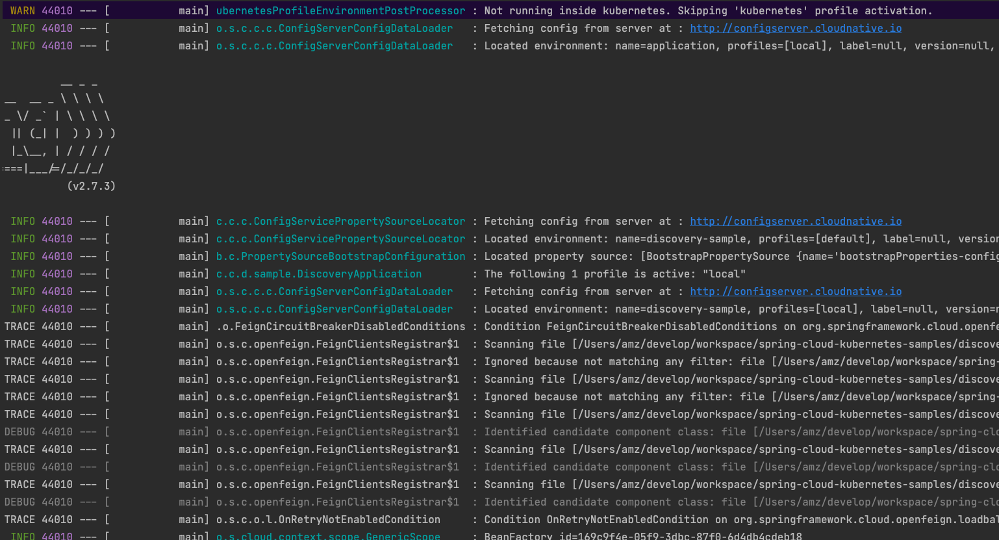
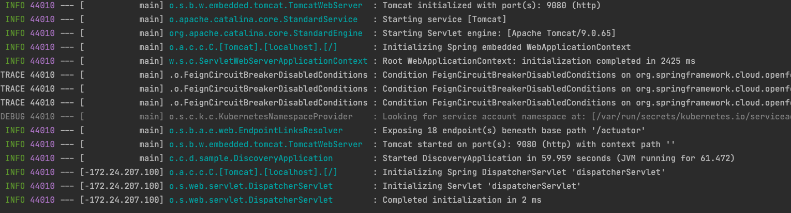

访问本地应用接口

```bash
❯ http :9080/info
HTTP/1.1 500 
Connection: close
Content-Type: application/json
Date: Wed, 14 Sep 2022 07:33:14 GMT
Transfer-Encoding: chunked

{
    "error": "Internal Server Error",
    "path": "/info",
    "status": 500,
    "timestamp": "2022-09-14T07:33:14.792+00:00"
}


❯ http :9080/r_info
HTTP/1.1 500 
Connection: close
Content-Type: application/json
Date: Wed, 14 Sep 2022 07:33:21 GMT
Transfer-Encoding: chunked

{
    "error": "Internal Server Error",
    "path": "/r_info",
    "status": 500,
    "timestamp": "2022-09-14T07:33:21.025+00:00"
}
```

此时程序报500，观察应用控制台日志如下：

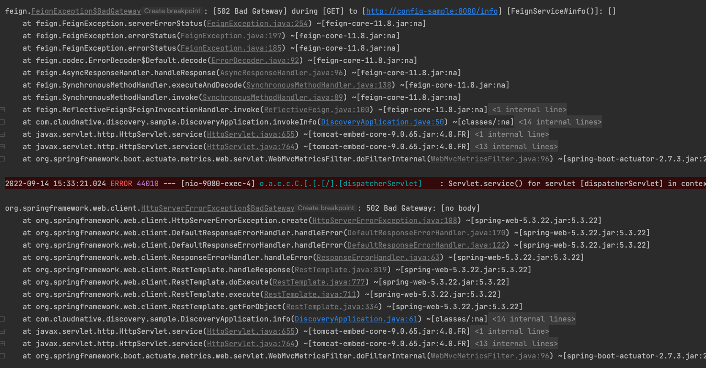

可见此时程序是直接访问kubernetes中的svc地址，很显然这在本地是不通的。因为我们在声明feign client时做了如下配置

```java
@FeignClient(value = "config-sample",url = "${feign.client.config-sample-url:http://config-sample:8080}")
```

我们只需要调整configmap中的配置，为`feign.client.config-sample-url`配置`ingress`访问地址，就可以正常访问kubernetes集群中的服务了。调整configmap如下并进行应用：

```yaml
apiVersion: v1
kind: ConfigMap
metadata:
  name: discovery-sample
  labels:
    # spring-cloud-kubernetes-configuration-watcher 监听 label
    spring.cloud.kubernetes.config: "true"
data:
  application.yml: |-
    spring:
      config:
        activate:
          on-profile: local
    feign:
      client:
        config-sample-url: http://configsample.cloudnative.io
        weibo-service-url: http://weiboservice.cloudnative.io
        weather-service-url: http://weatherservice.cloudnative.io
    ---
    spring:
      config:
        activate:
          on-profile: kubernetes
    feign:
      client:
        config-sample-url: http://config-sample:8080
        weibo-service-url: http://weibo-service:5000
        weather-service-url: http://weather-service:8080
```

```bash
❯ k apply -f k8s
configmap/discovery-sample configured
deployment.apps/discovery-sample configured
service/discovery-sample unchanged
ingress.networking.k8s.io/discoverysample-ingress unchanged
serviceaccount/admin-user unchanged
clusterrolebinding.rbac.authorization.k8s.io/admin-user unchanged
secret/discovery-sample unchanged
```

重启本地应用程序进行访问，此时发现可以正常调用到kubernetes集群中的服务了：

```bash
❯ http :9080/info
HTTP/1.1 200 
Connection: keep-alive
Content-Length: 92
Content-Type: text/plain;charset=UTF-8
Date: Wed, 14 Sep 2022 07:41:58 GMT
Keep-Alive: timeout=60

invoke by null，receive data: 2022-09-14 15:41:58:kubernetes:config-sample-866487d6d7-qrg2q


❯ http :9080/r_info
HTTP/1.1 200 
Connection: keep-alive
Content-Length: 61
Content-Type: text/plain;charset=UTF-8
Date: Wed, 14 Sep 2022 07:42:04 GMT
Keep-Alive: timeout=60

2022-09-14 15:42:04:kubernetes:config-sample-866487d6d7-jnb49
```


## 六、 gateway-sample（网关聚合微服务）

### 1、pom.xml中添加依赖

```xml
        <!-- 依赖spring-cloud-kubernetes-discoveryserver组件，直接与其通信，不需要本地存在 ~/.kube/config文件 -->
        <dependency>
            <groupId>org.springframework.cloud</groupId>
            <artifactId>spring-cloud-starter-kubernetes-discoveryclient</artifactId>
            <version>2.1.3</version>
        </dependency>
        <!-- 从configmap、secret加载应用配置文件 -->
        <dependency>
            <groupId>org.springframework.cloud</groupId>
            <artifactId>spring-cloud-starter-kubernetes-client-config</artifactId>
            <version>2.1.3</version>
        </dependency>
        <!-- spring-cloud-config-clien 从config server加载配置文件 -->
        <dependency>
            <groupId>org.springframework.cloud</groupId>
            <artifactId>spring-cloud-config-client</artifactId>
        </dependency>
        <dependency>
            <groupId>org.springframework.cloud</groupId>
            <artifactId>spring-cloud-starter-gateway</artifactId>
        </dependency>
        <dependency>
            <groupId>org.springframework.cloud</groupId>
            <artifactId>spring-cloud-starter-circuitbreaker-reactor-resilience4j</artifactId>
        </dependency>
        <!-- loadbalancer组件，不建议使用spring-cloud-starter-kubernetes-client-loadbalancer组件，该组件仍然会使用本地~/.kube/config文件进行通信 -->
        <dependency>
            <groupId>org.springframework.cloud</groupId>
            <artifactId>spring-cloud-starter-loadbalancer</artifactId>
        </dependency>
        <dependency>
            <groupId>org.springframework.boot</groupId>
            <artifactId>spring-boot-starter-actuator</artifactId>
        </dependency>
```

### 2、配置bootstrap.yml

application.yml 该文件放一些通用配置类信息

```yaml
server:
  port: 8070

spring:
  main:
    allow-bean-definition-overriding: true
  application:
    name: gateway-sample
  jackson:
    serialization:
      fail-on-empty-beans: false

logging:
  level:
    org.springframework.cloud.kubernetes: DEBUG
    org.springframework.cloud.gateway: INFO

management:
  endpoint:
    health:
      show-details: always
      enabled: true
    restart:
      enabled: true
    info:
      enabled: true
    gateway:
      enabled: true
  endpoints:
    web:
      exposure:
        include: '*'
```

bootstrap-local.yml 本地模式启动时的配置文件

```yaml
spring:
  config:
    activate:
      on-profile: local
    import: optional:configserver:http://configserver.cloudnative.io
  cloud:
    loadbalancer:
      enabled: true
      ribbon:
        enabled: false
    gateway:
      enabled: true
      discovery:
        locator:
          enabled: true
          lower-case-service-id: true
          url-expression: "'http://'+serviceId+':'+port"
    kubernetes:
      enabled: true
      config:
        name: gateway-sample
        namespace: default
        enabled: true
        enable-api: true
      secrets:
        name: gateway-sample
        namespace: default
        enabled: true
        enable-api: true
      reload:
        enabled: true
        mode: event
        strategy: refresh
        monitoring-config-maps: true
        monitoring-secrets: true
      loadbalancer:
        enabled: true
        mode: SERVICE
      discovery:
        # 开启服务注册发现
        enabled: true
        # 允许访问所有namespaces
        all-namespaces: true
        include-not-ready-addresses: false
        discovery-server-url: http://discoveryserver.cloudnative.io
```

bootstrap-kubernetes.yml kubernetes集群模式启动时的配置文件

```yaml
spring:
  config:
    activate:
      on-profile: kubernetes
    import: optional:configserver:http://spring-cloud-kubernetes-configserver:8888
  cloud:
    loadbalancer:
      enabled: true
      ribbon:
        enabled: false
    gateway:
      enabled: true
      discovery:
        locator:
          enabled: true
          lower-case-service-id: true
          url-expression: "'http://'+serviceId+':'+port"
    kubernetes:
      enabled: true
      config:
        name: gateway-sample
        namespace: default
        enabled: true
        enable-api: true
      secrets:
        name: gateway-sample
        namespace: default
        enabled: true
        enable-api: true
      reload:
        enabled: true
        mode: event
        strategy: refresh
        monitoring-config-maps: true
        monitoring-secrets: true
      loadbalancer:
        enabled: true
        mode: SERVICE
      discovery:
        # 开启服务注册发现
        enabled: true
        # 允许访问所有namespaces
        all-namespaces: true
        include-not-ready-addresses: false
        discovery-server-url: http://spring-cloud-kubernetes-discoveryserver
```

注意留意spring.cloud.gateway部分的配置。

### 3、打包部署

```bash
❯ mvn clean package -Dmaven.test.skip=true
❯ mvn spring-boot:build-image -Dmaven.test.skip=true
❯ k apply -f k8s

configmap/gateway-sample created
deployment.apps/gateway-sample created
service/gateway-sample created
ingress.networking.k8s.io/gateway-ingress created
serviceaccount/admin-user unchanged
clusterrolebinding.rbac.authorization.k8s.io/admin-user unchanged
secret/gateway-sample unchanged
❯ k get pod -owide
NAME                                                              READY   STATUS    RESTARTS   AGE    IP               NODE    NOMINATED NODE   READINESS GATES
config-sample-866487d6d7-jnb49                                    1/1     Running   0          4h     172.18.199.236   node7   <none>           <none>
config-sample-866487d6d7-kbp2p                                    1/1     Running   0          39m    172.18.104.74    node9   <none>           <none>
config-sample-866487d6d7-qrg2q                                    1/1     Running   0          39m    172.18.225.118   node8   <none>           <none>
discovery-sample-654dc778f9-m8qtb                                 1/1     Running   0          47m    172.18.225.115   node8   <none>           <none>
gateway-sample-684d7cd57c-md4mx                                   1/1     Running   0          35s    172.18.199.251   node7   <none>           <none>
nfs-client-provisioner-67cd9c9567-w8k7q                           1/1     Running   12         72d    172.18.104.4     node2   <none>           <none>
nginx-6799fc88d8-2fv2t                                            1/1     Running   0          7d1h   172.18.225.68    node8   <none>           <none>
spring-cloud-kubernetes-configserver-deployment-7d5667c44f7j9z7   1/1     Running   0          26h    172.18.104.71    node9   <none>           <none>
spring-cloud-kubernetes-configuration-watcher-deployment-5zltx9   1/1     Running   0          26h    172.18.104.69    node9   <none>           <none>
spring-cloud-kubernetes-discoveryserver-deployment-9d5d86d7lhnh   1/1     Running   0          26h    172.18.104.70    node9   <none>           <none>
❯ k get cm
NAME                                            DATA   AGE
config-sample                                   1      70m
discovery-sample                                1      69m
gateway-sample                                  1      39s
grafana-cert-cm                                 2      19d
kube-root-ca.crt                                1      112d
kubernetesconfigserver                          1      26h
spring-cloud-kubernetes-configuration-watcher   1      26h
❯ k get svc
NAME                                            TYPE        CLUSTER-IP       EXTERNAL-IP   PORT(S)    AGE
config-sample                                   ClusterIP   10.102.84.68     <none>        8080/TCP   4h1m
discovery-sample                                ClusterIP   10.104.120.36    <none>        9080/TCP   47m
gateway-sample                                  ClusterIP   10.103.47.114    <none>        8070/TCP   42s
kubernetes                                      ClusterIP   10.96.0.1        <none>        443/TCP    112d
spring-cloud-kubernetes-configserver            ClusterIP   10.109.120.151   <none>        8888/TCP   26h
spring-cloud-kubernetes-configuration-watcher   ClusterIP   10.110.146.208   <none>        8888/TCP   26h
spring-cloud-kubernetes-discoveryserver         ClusterIP   10.97.205.220    <none>        80/TCP     26h
❯ k get ingress
NAME                      CLASS    HOSTS                            ADDRESS     PORTS   AGE
configsample-ingress      <none>   configsample.cloudnative.io      localhost   80      4h1m
configserver-ingress      <none>   configserver.cloudnative.io      localhost   80      26h
discoverysample-ingress   <none>   discoverysample.cloudnative.io   localhost   80      70m
discoveryserver-ingress   <none>   discoveryserver.cloudnative.io   localhost   80      26h
gateway-ingress           <none>   gateway.cloudnative.io           localhost   80      44s
```

### 4、测试网关

#### 4.1、访问/actuator/gateway/routes`端点

```bash
❯ http gateway.cloudnative.io/actuator/gateway/routes
HTTP/1.1 200 OK
Connection: keep-alive
Content-Type: application/json
Date: Wed, 14 Sep 2022 07:51:06 GMT
Transfer-Encoding: chunked

[
    {
        "filters": [
            "[[StripPrefix parts = 1], order = 0]",
            "[[SpringCloudCircuitBreakerResilience4JFilterFactory name = 'config-sample', fallback = forward:/fallback], order = 0]"
        ],
        "order": 0,
        "predicate": "Paths: [/config-sample/**], match trailing slash: true",
        "route_id": "d8dd5d97-0bb5-4cc9-be22-57aac0fce27f",
        "uri": "lb://config-sample"
    },
    {
        "filters": [
            "[[StripPrefix parts = 1], order = 0]",
            "[[SpringCloudCircuitBreakerResilience4JFilterFactory name = 'discovery-sample', fallback = forward:/fallback], order = 0]"
        ],
        "order": 0,
        "predicate": "Paths: [/discovery-sample/**], match trailing slash: true",
        "route_id": "c87a442e-f0d8-4833-8436-28681c517a97",
        "uri": "lb://discovery-sample"
    },
    {
        "filters": [
            "[[StripPrefix parts = 1], order = 0]",
            "[[SpringCloudCircuitBreakerResilience4JFilterFactory name = 'weibo-service', fallback = forward:/fallback], order = 0]"
        ],
        "order": 0,
        "predicate": "Paths: [/news/**], match trailing slash: true",
        "route_id": "c4aaf2aa-4e98-4967-8a94-78869591331d",
        "uri": "lb://weibo-service"
    },
    {
        "filters": [
            "[[StripPrefix parts = 1], order = 0]",
            "[[SpringCloudCircuitBreakerResilience4JFilterFactory name = 'weather-service', fallback = forward:/fallback], order = 0]"
        ],
        "order": 0,
        "predicate": "Paths: [/weather/**], match trailing slash: true",
        "route_id": "9979a96f-e23f-4259-b093-3ca56fa5e7bf",
        "uri": "lb://weather-service"
    },
    {
        "filters": [
            "[[RewritePath /spring-cloud-kubernetes-configuration-watcher/?(?<remaining>.*) = '/${remaining}'], order = 1]"
        ],
        "metadata": {
            "app": "spring-cloud-kubernetes-configuration-watcher",
            "http": "8888",
            "kubectl.kubernetes.io/last-applied-configuration": "{\"apiVersion\":\"v1\",\"kind\":\"Service\",\"metadata\":{\"annotations\":{},\"labels\":{\"app\":\"spring-cloud-kubernetes-configuration-watcher\"},\"name\":\"spring-cloud-kubernetes-configuration-watcher\",\"namespace\":\"default\"},\"spec\":{\"ports\":[{\"name\":\"http\",\"port\":8888,\"targetPort\":8888}],\"selector\":{\"app\":\"spring-cloud-kubernetes-configuration-watcher\"},\"type\":\"ClusterIP\"}}\n"
        },
        "order": 0,
        "predicate": "Paths: [/spring-cloud-kubernetes-configuration-watcher/**], match trailing slash: true",
        "route_id": "ReactiveCompositeDiscoveryClient_spring-cloud-kubernetes-configuration-watcher",
        "uri": "http://spring-cloud-kubernetes-configuration-watcher:8888"
    },
    {
        "filters": [
            "[[RewritePath /kubernetes/?(?<remaining>.*) = '/${remaining}'], order = 1]"
        ],
        "metadata": {
            "component": "apiserver",
            "https": "6443",
            "provider": "kubernetes"
        },
        "order": 0,
        "predicate": "Paths: [/kubernetes/**], match trailing slash: true",
        "route_id": "ReactiveCompositeDiscoveryClient_kubernetes",
        "uri": "http://kubernetes:6443"
    },
    {
        "filters": [
            "[[RewritePath /config-sample/?(?<remaining>.*) = '/${remaining}'], order = 1]"
        ],
        "metadata": {
            "boot.spring.io/actuator": "http://:8080/actuator",
            "http": "8080",
            "kubectl.kubernetes.io/last-applied-configuration": "{\"apiVersion\":\"v1\",\"kind\":\"Service\",\"metadata\":{\"annotations\":{\"boot.spring.io/actuator\":\"http://:8080/actuator\"},\"name\":\"config-sample\",\"namespace\":\"default\"},\"spec\":{\"ports\":[{\"name\":\"http\",\"port\":8080,\"targetPort\":8080}],\"selector\":{\"app\":\"config-sample\"},\"type\":\"ClusterIP\"}}\n"
        },
        "order": 0,
        "predicate": "Paths: [/config-sample/**], match trailing slash: true",
        "route_id": "ReactiveCompositeDiscoveryClient_config-sample",
        "uri": "http://config-sample:8080"
    },
    {
        "filters": [
            "[[RewritePath /spring-cloud-kubernetes-configserver/?(?<remaining>.*) = '/${remaining}'], order = 1]"
        ],
        "metadata": {
            "app": "spring-cloud-kubernetes-configserver",
            "http": "8888",
            "kubectl.kubernetes.io/last-applied-configuration": "{\"apiVersion\":\"v1\",\"kind\":\"Service\",\"metadata\":{\"annotations\":{},\"labels\":{\"app\":\"spring-cloud-kubernetes-configserver\"},\"name\":\"spring-cloud-kubernetes-configserver\",\"namespace\":\"default\"},\"spec\":{\"ports\":[{\"name\":\"http\",\"port\":8888,\"targetPort\":8888}],\"selector\":{\"app\":\"spring-cloud-kubernetes-configserver\"},\"type\":\"ClusterIP\"}}\n"
        },
        "order": 0,
        "predicate": "Paths: [/spring-cloud-kubernetes-configserver/**], match trailing slash: true",
        "route_id": "ReactiveCompositeDiscoveryClient_spring-cloud-kubernetes-configserver",
        "uri": "http://spring-cloud-kubernetes-configserver:8888"
    },
    {
        "filters": [
            "[[RewritePath /spring-cloud-kubernetes-discoveryserver/?(?<remaining>.*) = '/${remaining}'], order = 1]"
        ],
        "metadata": {
            "app": "spring-cloud-kubernetes-discoveryserver",
            "http": "8761",
            "kubectl.kubernetes.io/last-applied-configuration": "{\"apiVersion\":\"v1\",\"kind\":\"Service\",\"metadata\":{\"annotations\":{},\"labels\":{\"app\":\"spring-cloud-kubernetes-discoveryserver\"},\"name\":\"spring-cloud-kubernetes-discoveryserver\",\"namespace\":\"default\"},\"spec\":{\"ports\":[{\"name\":\"http\",\"port\":80,\"targetPort\":8761}],\"selector\":{\"app\":\"spring-cloud-kubernetes-discoveryserver\"},\"type\":\"ClusterIP\"}}\n"
        },
        "order": 0,
        "predicate": "Paths: [/spring-cloud-kubernetes-discoveryserver/**], match trailing slash: true",
        "route_id": "ReactiveCompositeDiscoveryClient_spring-cloud-kubernetes-discoveryserver",
        "uri": "http://spring-cloud-kubernetes-discoveryserver:8761"
    },
    {
        "filters": [
            "[[RewritePath /gateway-sample/?(?<remaining>.*) = '/${remaining}'], order = 1]"
        ],
        "metadata": {
            "boot.spring.io/actuator": "http://:8070/actuator",
            "http": "8070",
            "kubectl.kubernetes.io/last-applied-configuration": "{\"apiVersion\":\"v1\",\"kind\":\"Service\",\"metadata\":{\"annotations\":{\"boot.spring.io/actuator\":\"http://:8070/actuator\"},\"name\":\"gateway-sample\",\"namespace\":\"default\"},\"spec\":{\"ports\":[{\"name\":\"http\",\"port\":8070,\"targetPort\":8070}],\"selector\":{\"app\":\"gateway-sample\"},\"type\":\"ClusterIP\"}}\n"
        },
        "order": 0,
        "predicate": "Paths: [/gateway-sample/**], match trailing slash: true",
        "route_id": "ReactiveCompositeDiscoveryClient_gateway-sample",
        "uri": "http://gateway-sample:8070"
    },
    {
        "filters": [
            "[[RewritePath /discovery-sample/?(?<remaining>.*) = '/${remaining}'], order = 1]"
        ],
        "metadata": {
            "boot.spring.io/actuator": "http://:9080/actuator",
            "http": "9080",
            "kubectl.kubernetes.io/last-applied-configuration": "{\"apiVersion\":\"v1\",\"kind\":\"Service\",\"metadata\":{\"annotations\":{\"boot.spring.io/actuator\":\"http://:9080/actuator\"},\"name\":\"discovery-sample\",\"namespace\":\"default\"},\"spec\":{\"ports\":[{\"name\":\"http\",\"port\":9080,\"targetPort\":9080}],\"selector\":{\"app\":\"discovery-sample\"},\"type\":\"ClusterIP\"}}\n"
        },
        "order": 0,
        "predicate": "Paths: [/discovery-sample/**], match trailing slash: true",
        "route_id": "ReactiveCompositeDiscoveryClient_discovery-sample",
        "uri": "http://discovery-sample:9080"
    }
]
```

#### 4.2、通过网关访问应用

```bash
❯ http gateway.cloudnative.io/config-sample/info
HTTP/1.1 200 OK
Connection: keep-alive
Content-Length: 61
Content-Type: text/plain;charset=UTF-8
Date: Wed, 14 Sep 2022 07:53:01 GMT

2022-09-14 15:53:00:kubernetes:config-sample-866487d6d7-kbp2p


❯ http gateway.cloudnative.io/discovery-sample/info
HTTP/1.1 200 OK
Connection: keep-alive
Content-Length: 121
Content-Type: text/plain;charset=UTF-8
Date: Wed, 14 Sep 2022 07:53:19 GMT

invoke by discovery-sample-654dc778f9-m8qtb，receive data: 2022-09-14 15:53:19:kubernetes:config-sample-866487d6d7-qrg2q
```

#### 4.3、测试服务熔断

```bash
❯ k scale --replicas 0 deployment discovery-sample
deployment.apps/discovery-sample scaled
❯ http gateway.cloudnative.io/discovery-sample/info
HTTP/1.1 200 OK
Connection: keep-alive
Content-Length: 57
Content-Type: application/json
Date: Wed, 14 Sep 2022 07:56:39 GMT
fallback: true

{
    "code": 503,
    "msg": "服务不可用，请稍后再试！"
}
❯ http gateway.cloudnative.io/config-sample/info
HTTP/1.1 200 OK
Connection: keep-alive
Content-Length: 57
Content-Type: application/json
Date: Wed, 14 Sep 2022 07:57:31 GMT
fallback: true

{
    "code": 503,
    "msg": "服务不可用，请稍后再试！"
}
```

具体熔断部分代码配置如下：

```java
    @Bean
    public RouteLocator routes(RouteLocatorBuilder builder) {
        return builder.routes()
                .route(p -> p.path("/config-sample/**")
                        .filters(f -> f
                                // 去前缀
                                .stripPrefix(1)
                                // 设置熔断
                                .circuitBreaker(c -> c.setName("config-sample").setFallbackUri("forward:/fallback")))
                        .uri("lb://config-sample"))
                .route(p -> p.path("/discovery-sample/**")
                        .filters(f -> f
                                // 去前缀
                                .stripPrefix(1)
                                // 设置熔断
                                .circuitBreaker(c -> c.setName("discovery-sample").setFallbackUri("forward:/fallback")))
                        .uri("lb://discovery-sample"))
                .route(p -> p.path("/news/**")
                        .filters(f -> f
                                // 去前缀
                                .stripPrefix(1)
                                // 设置熔断
                                .circuitBreaker(c -> c.setName("weibo-service").setFallbackUri("forward:/fallback")))
                        .uri("lb://weibo-service"))
                .route(p -> p.path("/weather/**")
                        .filters(f -> f
                                // 去前缀
                                .stripPrefix(1)
                                // 设置熔断
                                .circuitBreaker(c -> c.setName("weather-service").setFallbackUri("forward:/fallback")))
                        .uri("lb://weather-service"))
                .build();
    }

    @GetMapping("/fallback")
    public ResponseEntity<Object> fallback() {
        HttpHeaders headers = new HttpHeaders();
        headers.add("fallback", "true");
        Map<String,Object> map = new HashMap<>();
        map.put("code",503);
        map.put("msg","服务不可用，请稍后再试！");
        return ResponseEntity.ok().headers(headers).body(map);
    }
```

## 七、异构微服务

### 1、weibo-service（Python应用）

该应用使用python，基于pandas和flask获取微博头条数据。其具体代码如下：

```python
import pandas as pd
import requests
import urllib3
import logging
from flask import Flask

urllib3.disable_warnings()

app = Flask(__name__)


@app.route("/")
def weibo_hot_news():
    headers = {
        'Connection': 'keep-alive',
        'Pragma': 'no-cache',
        'Cache-Control': 'no-cache',
        'Upgrade-Insecure-Requests': '1',
        'User-Agent': 'Mozilla/5.0 (Windows NT 10.0; Win64; x64) AppleWebKit/537.36 (KHTML, like Gecko) '
                      'Chrome/96.0.4664.110 Safari/537.36 Edg/96.0.1054.62',
        'Accept': 'text/html,application/xhtml+xml,application/xml;q=0.9,image/webp,'
                  'image/apng,*/*;q=0.8,application/signed-exchange;v=b3;q=0.9',
        'Accept-Language': 'zh-CN,zh;q=0.9,en-US;q=0.8,en;q=0.7',
    }
    cookies = {
        'SUB': '_2A25MysX2DeRhGedO7loZ9CzFzDmIHXVvobA-rDV8PUNbmtB-LVqskW9NXU6ZHzPAAid8XPEIeIYICjMy1AvT2Pu4',
    }
    url = 'https://s.weibo.com/top/summary?cate=realtimehot'
    resp = requests.get(url, headers=headers, cookies=cookies)
    df = pd.read_html(resp.text, encoding='utf-8', skiprows=1)[0]  # 跳过第一行，查找页面中第一个表格
    df.columns = ['id', 'title', 'tag']  # 重命名列名
    df = df[df['id'] != '•']  # 过滤掉index不为'•'的行数据
    df = df.iloc[:, :-1]  # '取所有行数据，不包含最后一列 tag'
    df['news'] = df['title'].apply(lambda x: x.split('  ')[0])  # 拆分列
    df['hot'] = df['title'].apply(lambda x: x.split('  ')[1])  # 拆分列，并新增一列
    df.drop(axis=1, labels='title', inplace=True)  # 删除列
    return df.to_json(orient='records')

@app.route("/info")
def invoke_info():
    resp = requests.get('http://config-sample:8080/info')
    return resp.text

if __name__ == '__main__':
    app.run(host="0.0.0.0", debug=True, port=5000)

if __name__ != '__main__':
    # 如果不是直接运行，则将日志输出到 gunicorn 中
    gunicorn_logger = logging.getLogger('gunicorn.error')
    app.logger.handlers = gunicorn_logger.handlers
    app.logger.setLevel(gunicorn_logger.level)
```

kubernetes集群中部署该应用

```bash
❯ k apply -f k8s
deployment.apps/weibo-service created
service/weibo-service created
ingress.networking.k8s.io/weibo-service-ingress created
❯ k get pod -owide
NAME                                                              READY   STATUS    RESTARTS   AGE     IP               NODE    NOMINATED NODE   READINESS GATES
config-sample-866487d6d7-6rmjw                                    1/1     Running   0          7m20s   172.18.104.79    node9   <none>           <none>
config-sample-866487d6d7-gmcqd                                    1/1     Running   0          7m20s   172.18.199.253   node7   <none>           <none>
config-sample-866487d6d7-n9gr4                                    1/1     Running   0          7m20s   172.18.225.121   node8   <none>           <none>
discovery-sample-654dc778f9-n9qbh                                 1/1     Running   0          7m10s   172.18.199.254   node7   <none>           <none>
discovery-sample-654dc778f9-vxr92                                 1/1     Running   0          7m10s   172.18.225.122   node8   <none>           <none>
discovery-sample-654dc778f9-z4vns                                 1/1     Running   0          7m10s   172.18.104.80    node9   <none>           <none>
gateway-sample-684d7cd57c-md4mx                                   1/1     Running   0          15m     172.18.199.251   node7   <none>           <none>
nfs-client-provisioner-67cd9c9567-w8k7q                           1/1     Running   12         72d     172.18.104.4     node2   <none>           <none>
nginx-6799fc88d8-2fv2t                                            1/1     Running   0          7d1h    172.18.225.68    node8   <none>           <none>
spring-cloud-kubernetes-configserver-deployment-7d5667c44f7j9z7   1/1     Running   0          26h     172.18.104.71    node9   <none>           <none>
spring-cloud-kubernetes-configuration-watcher-deployment-5zltx9   1/1     Running   0          27h     172.18.104.69    node9   <none>           <none>
spring-cloud-kubernetes-discoveryserver-deployment-9d5d86d7lhnh   1/1     Running   0          27h     172.18.104.70    node9   <none>           <none>
weibo-service-65f6b98d6d-kw4v8                                    1/1     Running   0          43s     172.18.199.195   node7   <none>           <none>
❯ k get svc
NAME                                            TYPE        CLUSTER-IP       EXTERNAL-IP   PORT(S)    AGE
config-sample                                   ClusterIP   10.102.84.68     <none>        8080/TCP   4h16m
discovery-sample                                ClusterIP   10.104.120.36    <none>        9080/TCP   62m
gateway-sample                                  ClusterIP   10.103.47.114    <none>        8070/TCP   16m
kubernetes                                      ClusterIP   10.96.0.1        <none>        443/TCP    112d
spring-cloud-kubernetes-configserver            ClusterIP   10.109.120.151   <none>        8888/TCP   27h
spring-cloud-kubernetes-configuration-watcher   ClusterIP   10.110.146.208   <none>        8888/TCP   27h
spring-cloud-kubernetes-discoveryserver         ClusterIP   10.97.205.220    <none>        80/TCP     27h
weibo-service                                   ClusterIP   10.104.139.14    <none>        5000/TCP   68s
❯ k get ingress
NAME                      CLASS    HOSTS                            ADDRESS     PORTS   AGE
configsample-ingress      <none>   configsample.cloudnative.io      localhost   80      4h16m
configserver-ingress      <none>   configserver.cloudnative.io      localhost   80      27h
discoverysample-ingress   <none>   discoverysample.cloudnative.io   localhost   80      85m
discoveryserver-ingress   <none>   discoveryserver.cloudnative.io   localhost   80      27h
gateway-ingress           <none>   gateway.cloudnative.io           localhost   80      16m
weibo-service-ingress     <none>   weiboservice.cloudnative.io      localhost   80      71s
```

访问应用：

```bash
❯ http weiboservice.cloudnative.io
HTTP/1.1 200 OK
Connection: close
Content-Length: 5032
Content-Type: text/html; charset=utf-8
Date: Wed, 14 Sep 2022 08:16:01 GMT
Server: Werkzeug/2.2.2 Python/3.10.6

[
    {
        "hot": "1684691",
        "id": "1",
        "news": "家属叫不出产妇全名护士拒给娃"
    },
    {
        "hot": "1169096",
        "id": "2",
        "news": "敦煌考古编制岗位无人问津"
    },
    {
        "hot": "1059684",
        "id": "3",
        "news": "消防员车上挂满泸定人送的哈达"
    },
    {
        "hot": "1025100",
        "id": "4",
        "news": "冯远征就任北京人艺第五任院长"
    },
    {
        "hot": "1010209",
        "id": "5",
        "news": "雷军卸任小米电子软件公司董事长"
    },
    {
        "hot": "886914",
        "id": "6",
        "news": "妈妈其实把你养得很好"
    },
    {
        "hot": "810598",
        "id": "7",
        "news": "羊了个羊急招后端开发"
    },
    {
        "hot": "567729",
        "id": "8",
        "news": "解放军20分钟在长江架起一座桥"
    }
]
```

### 2、weather-service （Go应用）

该应用使用golang，使用go-resty获取天气预报数据，gin对外提供服务。其具体代码如下：

```go
package main

import (
	"encoding/json"
	"net/http"
	"weather-service/model"

	"github.com/gin-gonic/gin"
	"github.com/go-resty/resty/v2"
)

func GetWeather(ctx *gin.Context) {
	client := resty.New()
	resp, _ := client.R().Get("http://www.tianqiapi.com/api?version=v9&appid=23035354&appsecret=8YvlPNrz")
	weather := model.WeatherInfo{}
	_ = json.Unmarshal(resp.Body(), &weather)
	ctx.JSON(http.StatusOK, weather)
}

func main() {
	router := gin.Default()
	router.GET("/", GetWeather)
	_ = router.Run(":8080")
}
```

Dockerfile

```dockerfile
FROM golang:1.18-alpine as builder
WORKDIR /app
COPY . .
RUN go env -w GO111MODULE=on \
    && go env -w GOPROXY=https://goproxy.cn,direct \
    && go env -w CGO_ENABLED=0 \
    && go env \
    && go mod tidy \
    && go build -o weather .

FROM scratch
LABEL MAINTAINER="fengj@anchnet.com"
WORKDIR /app
COPY --from=builder /app/weather .
EXPOSE 8080
ENTRYPOINT ["./weather"]
```

这里Dockerfile最终打包使用的基础镜像为`scratch`，类似于一个空白镜像，用该镜像打出的包体积特别小。

kubernetes集群中部署该应用：

```bash
❯ k apply -f k8s
deployment.apps/weather-service created
service/weather-service created
ingress.networking.k8s.io/weather-service-ingress created
❯ k get pod -owide
NAME                                                              READY   STATUS    RESTARTS   AGE    IP               NODE    NOMINATED NODE   READINESS GATES
config-sample-866487d6d7-6rmjw                                    1/1     Running   0          20m    172.18.104.79    node9   <none>           <none>
config-sample-866487d6d7-gmcqd                                    1/1     Running   0          20m    172.18.199.253   node7   <none>           <none>
config-sample-866487d6d7-n9gr4                                    1/1     Running   0          20m    172.18.225.121   node8   <none>           <none>
discovery-sample-654dc778f9-n9qbh                                 1/1     Running   0          20m    172.18.199.254   node7   <none>           <none>
discovery-sample-654dc778f9-vxr92                                 1/1     Running   0          20m    172.18.225.122   node8   <none>           <none>
discovery-sample-654dc778f9-z4vns                                 1/1     Running   0          20m    172.18.104.80    node9   <none>           <none>
gateway-sample-684d7cd57c-md4mx                                   1/1     Running   0          29m    172.18.199.251   node7   <none>           <none>
nfs-client-provisioner-67cd9c9567-w8k7q                           1/1     Running   12         72d    172.18.104.4     node2   <none>           <none>
nginx-6799fc88d8-2fv2t                                            1/1     Running   0          7d1h   172.18.225.68    node8   <none>           <none>
spring-cloud-kubernetes-configserver-deployment-7d5667c44f7j9z7   1/1     Running   0          26h    172.18.104.71    node9   <none>           <none>
spring-cloud-kubernetes-configuration-watcher-deployment-5zltx9   1/1     Running   0          27h    172.18.104.69    node9   <none>           <none>
spring-cloud-kubernetes-discoveryserver-deployment-9d5d86d7lhnh   1/1     Running   0          27h    172.18.104.70    node9   <none>           <none>
weather-service-6dfd55b894-tqbmq                                  1/1     Running   0          27s    172.18.225.124   node8   <none>           <none>
weibo-service-65f6b98d6d-kw4v8                                    1/1     Running   0          14m    172.18.199.195   node7   <none>           <none>
❯ k get svc
NAME                                            TYPE        CLUSTER-IP       EXTERNAL-IP   PORT(S)    AGE
config-sample                                   ClusterIP   10.102.84.68     <none>        8080/TCP   4h29m
discovery-sample                                ClusterIP   10.104.120.36    <none>        9080/TCP   76m
gateway-sample                                  ClusterIP   10.103.47.114    <none>        8070/TCP   29m
kubernetes                                      ClusterIP   10.96.0.1        <none>        443/TCP    112d
spring-cloud-kubernetes-configserver            ClusterIP   10.109.120.151   <none>        8888/TCP   27h
spring-cloud-kubernetes-configuration-watcher   ClusterIP   10.110.146.208   <none>        8888/TCP   27h
spring-cloud-kubernetes-discoveryserver         ClusterIP   10.97.205.220    <none>        80/TCP     27h
weather-service                                 ClusterIP   10.110.140.181   <none>        8080/TCP   46s
weibo-service                                   ClusterIP   10.104.139.14    <none>        5000/TCP   14m
❯ k get ingress
NAME                      CLASS    HOSTS                            ADDRESS     PORTS   AGE
configsample-ingress      <none>   configsample.cloudnative.io      localhost   80      4h29m
configserver-ingress      <none>   configserver.cloudnative.io      localhost   80      27h
discoverysample-ingress   <none>   discoverysample.cloudnative.io   localhost   80      98m
discoveryserver-ingress   <none>   discoveryserver.cloudnative.io   localhost   80      27h
gateway-ingress           <none>   gateway.cloudnative.io           localhost   80      29m
weather-service-ingress   <none>   weatherservice.cloudnative.io    localhost   80      47s
weibo-service-ingress     <none>   weiboservice.cloudnative.io      localhost   80      14m
```

访问应用：

```bash
❯ http weatherservice.cloudnative.io
HTTP/1.1 200 OK
Connection: keep-alive
Content-Type: application/json; charset=utf-8
Date: Wed, 14 Sep 2022 08:19:46 GMT
Transfer-Encoding: chunked

{
    "aqi": {
        "air": "15",
        "air_level": "优",
        "air_tips": "空气很好，可以外出活动，呼吸新鲜空气，拥抱大自然！",
        "city": "无锡",
        "cityEn": "wuxi",
        "cityid": "101190201",
        "co": "-",
        "co_desc": "-",
        "country": "中国",
        "countryEn": "China",
        "jinghuaqi": "关闭净化器",
        "kaichuang": "适宜开窗",
        "kouzhao": "不用佩戴口罩",
    },
    "city": "无锡",
    "cityEn": "wuxi",
    "cityid": "101190201",
    "country": "中国",
    "countryEn": "China",
    "data": [
        {
            "air": "14",
            "air_level": "优",
            "air_tips": "空气很好，可以外出活动，呼吸新鲜空气，拥抱大自然！",
            "alarm": {
                "alarm_content": "无锡市气象台2022年09月14日04时48分继续发布暴雨黄色预警信号：受台风“梅花”影响，预计未来24小时内我市大部分地区的街道（镇）将出现6小时50毫米以上的强降水，请注意防范。（预警信息来源：国家预警信息发布中心）",
                "alarm_level": "黄色",
                "alarm_type": "暴雨"
            },
            "date": "2022-09-14",
            "day": "14日（星期三）",
            "hours": [
                {
                    "hours": "08时",
                    "tem": "22",
                    "wea": "中雨",
                    "wea_img": "yu",
                    "win": "北风",
                    "win_speed": "<3级"
                }
            ],
            "humidity": "79%",
            "index": [
                {
                    "desc": "辐射弱，涂擦SPF8-12防晒护肤品。",
                    "level": "最弱",
                    "title": "紫外线指数"
                },
                {
                    "desc": "春天快来了，雨天坚持室内运动吧。",
                    "level": "一颗星",
                    "title": "减肥指数"
                },
            ],
            "wea": "多云",
            "wea_day": "中雨",
            "wea_day_img": "yu",
            "wea_img": "yun",
            "wea_night": "暴雨",
            "wea_night_img": "yu",
            "week": "星期三",
            "win": [
                "北风",
                "北风"
            ],
            "win_meter": "8km/h",
            "win_speed": "<3级转4-5级"
        },
        {
            "air": "30",
            "air_level": "优",
            "air_tips": "",
            "alarm": {
                "alarm_content": "",
                "alarm_level": "",
                "alarm_type": ""
            }
        }
    ],
    "update_time": "2022-09-14 15:07:55"
}
```

### 3、通过网关访问异构应用

```bash
❯ http gateway.cloudnative.io/actuator/gateway/routes
HTTP/1.1 200 OK
Connection: keep-alive
Content-Type: application/json
Date: Wed, 14 Sep 2022 08:24:48 GMT
Transfer-Encoding: chunked

[
    {
        "filters": [
            "[[StripPrefix parts = 1], order = 0]",
            "[[SpringCloudCircuitBreakerResilience4JFilterFactory name = 'weibo-service', fallback = forward:/fallback], order = 0]"
        ],
        "order": 0,
        "predicate": "Paths: [/news/**], match trailing slash: true",
        "route_id": "c4aaf2aa-4e98-4967-8a94-78869591331d",
        "uri": "lb://weibo-service"
    },
    {
        "filters": [
            "[[StripPrefix parts = 1], order = 0]",
            "[[SpringCloudCircuitBreakerResilience4JFilterFactory name = 'weather-service', fallback = forward:/fallback], order = 0]"
        ],
        "order": 0,
        "predicate": "Paths: [/weather/**], match trailing slash: true",
        "route_id": "9979a96f-e23f-4259-b093-3ca56fa5e7bf",
        "uri": "lb://weather-service"
    },
    {
        "filters": [
            "[[RewritePath /weather-service/?(?<remaining>.*) = '/${remaining}'], order = 1]"
        ],
        "metadata": {
            "http": "8080",
            "kubectl.kubernetes.io/last-applied-configuration": "{\"apiVersion\":\"v1\",\"kind\":\"Service\",\"metadata\":{\"annotations\":{},\"name\":\"weather-service\",\"namespace\":\"default\"},\"spec\":{\"ports\":[{\"name\":\"http\",\"port\":8080,\"protocol\":\"TCP\",\"targetPort\":8080}],\"selector\":{\"app\":\"weather-service\"},\"type\":\"ClusterIP\"}}\n"
        },
        "order": 0,
        "predicate": "Paths: [/weather-service/**], match trailing slash: true",
        "route_id": "ReactiveCompositeDiscoveryClient_weather-service",
        "uri": "http://weather-service:8080"
    },
    {
        "filters": [
            "[[RewritePath /weibo-service/?(?<remaining>.*) = '/${remaining}'], order = 1]"
        ],
        "metadata": {
            "http": "5000",
            "kubectl.kubernetes.io/last-applied-configuration": "{\"apiVersion\":\"v1\",\"kind\":\"Service\",\"metadata\":{\"annotations\":{},\"name\":\"weibo-service\",\"namespace\":\"default\"},\"spec\":{\"ports\":[{\"name\":\"http\",\"port\":5000,\"protocol\":\"TCP\",\"targetPort\":5000}],\"selector\":{\"app\":\"weibo-service\"},\"type\":\"ClusterIP\"}}\n"
        },
        "order": 0,
        "predicate": "Paths: [/weibo-service/**], match trailing slash: true",
        "route_id": "ReactiveCompositeDiscoveryClient_weibo-service",
        "uri": "http://weibo-service:5000"
    }
]

```

发现除了代码中显式配置的路由信息外，spring cloud gateway也自动注册了`/weibo-service/**`和`/weather-service/**`路由信息。

使用上面网关中的路由访问weibo-service和weather-service

```bash
❯ http gateway.cloudnative.io/weibo-service
HTTP/1.1 200 OK
Connection: keep-alive
Content-Length: 5043
Content-Type: text/html; charset=utf-8
Date: Wed, 14 Sep 2022 08:30:00 GMT

[
    {
        "hot": "1526819",
        "id": "1",
        "news": "家属叫不出产妇全名护士拒给娃"
    },
    {
        "hot": "剧集 1485971",
        "id": "2",
        "news": "张翰的肚子"
    },
    {
        "hot": "1212860",
        "id": "3",
        "news": "消防员车上挂满泸定人送的哈达"
    },
    {
        "hot": "1063658",
        "id": "4",
        "news": "羊了个羊急招后端开发"
    },
    {
        "hot": "1007695",
        "id": "5",
        "news": "敦煌考古编制岗位无人问津"
    }
]
---
❯ http gateway.cloudnative.io/news
HTTP/1.1 200 OK
Connection: keep-alive
Content-Length: 5043
Content-Type: text/html; charset=utf-8
Date: Wed, 14 Sep 2022 08:30:00 GMT
```

```bash
❯ http gateway.cloudnative.io/weather-service
HTTP/1.1 200 OK
Connection: keep-alive
Content-Type: application/json; charset=utf-8
Date: Wed, 14 Sep 2022 08:43:26 GMT
Transfer-Encoding: chunked
......
---
❯ http gateway.cloudnative.io/weather
HTTP/1.1 200 OK
Connection: keep-alive
Content-Type: application/json; charset=utf-8
Date: Wed, 14 Sep 2022 08:42:38 GMT
Transfer-Encoding: chunked
......
```

通过gateway访问weibo-service，weibo-service内部再调用config-sample。

```bash
❯ http gateway.cloudnative.io/weibo-service/info
HTTP/1.1 200 OK
Connection: keep-alive
Content-Length: 61
Content-Type: text/html; charset=utf-8
Date: Wed, 14 Sep 2022 08:48:15 GMT

2022-09-14 16:48:02:kubernetes:config-sample-866487d6d7-n9gr4
```

通过gateway访问discovery-sample，获取weather-service提供的天气信息。

```bash
❯ http gateway.cloudnative.io/discovery-sample/weatherInfo
HTTP/1.1 200 OK
Connection: keep-alive
Content-Type: application/json
Date: Wed, 14 Sep 2022 08:49:20 GMT
Transfer-Encoding: chunked
```

至此，基于kubernetes的异构微服务注册发现测试功能正常。

## 八、本地访问集群服务及远程调试集群中服务

有时候我们可能需要与kubernetes集群中的服务进行联调，阿里开源的`kt-connect`可以很好的满足我们的这一需求。具体安装步骤和实现原理可查看其官方文档。

### 1、在本地执行如下命令，即可打通本地和kubernetes集群中的网络连接

```bash
❯ sudo ktctl connect
Password:
5:16PM INF Using cluster context k8s-dev (cluster-b796g6fbkm)
5:16PM INF KtConnect 0.3.6 start at 50967 (darwin amd64)
5:16PM INF Fetching cluster time ...
5:16PM INF Fetching cluster time ...
5:16PM INF Fetching cluster time ...
5:16PM INF Fetching cluster time ...
5:16PM INF Using tun2socks mode
5:16PM INF Successful create config map kt-connect-shadow-qpbwd
5:16PM INF Deploying shadow pod kt-connect-shadow-qpbwd in namespace default
5:16PM INF Waiting for pod kt-connect-shadow-qpbwd ...
5:16PM INF Pod kt-connect-shadow-qpbwd is ready
5:16PM INF Port forward local:49434 -> pod kt-connect-shadow-qpbwd:22 established
5:16PM INF Socks proxy established
5:16PM INF Tun device utun3 is ready
5:16PM INF Adding route to 10.111.0.0/16
5:16PM INF Adding route to 10.108.0.0/16
5:16PM INF Adding route to 10.105.0.0/16
5:16PM INF Adding route to 10.103.0.0/16
5:16PM INF Adding route to 10.98.122.81/32
5:16PM INF Adding route to 10.96.0.0/16
5:16PM INF Adding route to 10.106.0.0/16
5:16PM INF Adding route to 10.102.0.0/16
5:16PM INF Adding route to 10.100.229.197/32
5:16PM INF Adding route to 10.104.0.0/16
5:16PM INF Adding route to 10.109.0.0/16
5:16PM INF Adding route to 10.110.0.0/16
5:16PM INF Adding route to 10.97.0.0/16
5:16PM INF Adding route to 10.101.0.0/16
5:16PM INF Adding route to 10.107.21.40/32
5:16PM INF Adding route to 10.99.0.0/16
5:16PM INF Adding route to 172.18.0.0/16
5:16PM INF Adding route to 172.16.0.0/16
5:16PM INF Adding route to 192.168.101.0/24
5:16PM INF Route to tun device completed
5:16PM INF Setting up dns in local mode
5:16PM INF Port forward local:47956 -> pod kt-connect-shadow-qpbwd:53 established
5:16PM INF Setup local DNS with upstream [tcp:127.0.0.1:47956 udp:223.5.5.5:53]
5:16PM INF Creating udp dns on port 10053
5:16PM INF ---------------------------------------------------------------
5:16PM INF  All looks good, now you can access to resources in the kubernetes cluster
5:16PM INF ---------------------------------------------------------------
```

### 2、直接在本地访问kubernetes的svc和pod

```bash
# 访问SVC
❯ http spring-cloud-kubernetes-discoveryserver/apps/weibo-service
HTTP/1.1 200 OK
Content-Type: application/json
transfer-encoding: chunked

[
    {
        "cluster": null,
        "host": "172.18.199.195",
        "instanceId": "014911e7-e8b3-455f-a9a2-e79220228a8c",
        "metadata": {
            "http": "5000",
            "kubectl.kubernetes.io/last-applied-configuration": "{\"apiVersion\":\"v1\",\"kind\":\"Service\",\"metadata\":{\"annotations\":{},\"name\":\"weibo-service\",\"namespace\":\"default\"},\"spec\":{\"ports\":[{\"name\":\"http\",\"port\":5000,\"protocol\":\"TCP\",\"targetPort\":5000}],\"selector\":{\"app\":\"weibo-service\"},\"type\":\"ClusterIP\"}}\n"
        },
        "namespace": "default",
        "port": 5000,
        "scheme": "http",
        "secure": false,
        "serviceId": "weibo-service",
        "uri": "http://172.18.199.195:5000"
    }
]
---
# 访问POD IP
❯ http 172.18.225.121:8080/info
HTTP/1.1 200 
Connection: keep-alive
Content-Length: 61
Content-Type: text/plain;charset=UTF-8
Date: Wed, 14 Sep 2022 09:20:39 GMT
Keep-Alive: timeout=60

2022-09-14 17:20:39:kubernetes:config-sample-866487d6d7-n9gr4
```

### 3、将集群中的流量切回本地，在进行本地调试

* 首先在本地以debug方式运行要调试的目标程序

* 接着在本地执行如下命令

```bash
ktctl exchange <目标服务名> --expose <本地端口>:<目标服务端口>
```

```bash
❯ ktctl exchange config-sample --expose 8080:8080
5:26PM INF Using cluster context k8s-dev (cluster-b796g6fbkm)
5:26PM INF KtConnect 0.3.6 start at 51730 (darwin amd64)
5:26PM INF Fetching cluster time ...
5:26PM INF Using selector mode
5:26PM INF Service config-sample locked
5:26PM INF Successful create config map config-sample-kt-exchange-cjxwu
5:26PM INF Deploying shadow pod config-sample-kt-exchange-cjxwu in namespace default
5:26PM INF Waiting for pod config-sample-kt-exchange-cjxwu ...
5:26PM INF Pod config-sample-kt-exchange-cjxwu is ready
5:26PM INF Forwarding pod config-sample-kt-exchange-cjxwu to local via port 8080:8080
5:26PM INF Port forward local:22208 -> pod config-sample-kt-exchange-cjxwu:22 established
5:26PM INF Reverse tunnel 0.0.0.0:8080 -> 127.0.0.1:8080 established
5:26PM INF Service config-sample unlocked
5:26PM INF ---------------------------------------------------------------
5:26PM INF  Now all request to service 'config-sample' will be redirected to local
5:26PM INF ---------------------------------------------------------------
```

**命令解释：**

config-sample 为目标svc的名称；

--expose <本地端口>:<目标SVC端口>；

* 最后访问目标service

```bash
❯ http configsample.cloudnative.io/info
```

* 在idea中进行debug调试

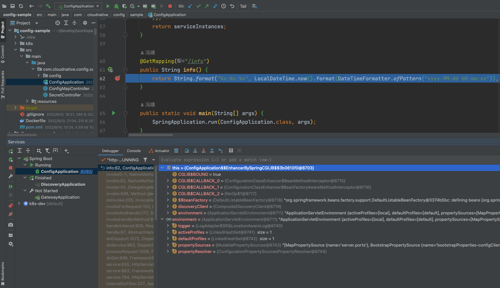

还有其他更高级的用法具体可参考官方文档。

## 参考文档

https://spring.io/blog/2021/10/26/new-features-for-spring-cloud-kubernetes-in-spring-cloud-2021-0-0-m3

https://docs.spring.io/spring-cloud-kubernetes/docs/current/reference/html

https://hackmd.io/@ryanjbaxter/spring-on-k8s-workshop

https://github.com/alibaba/kt-connect